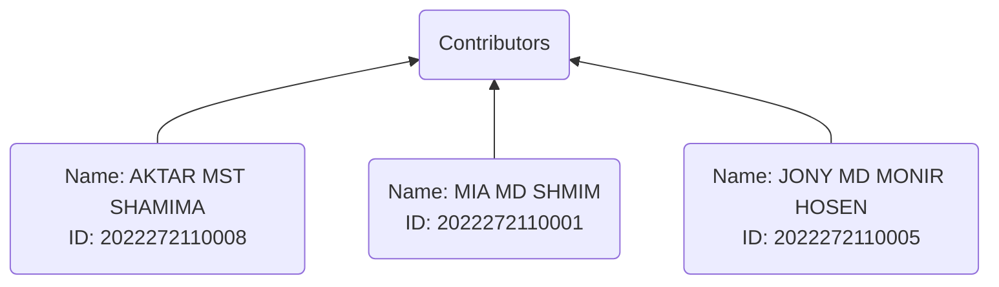
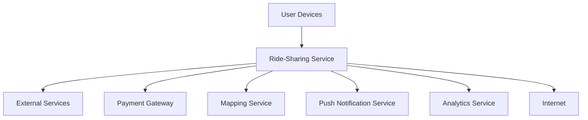
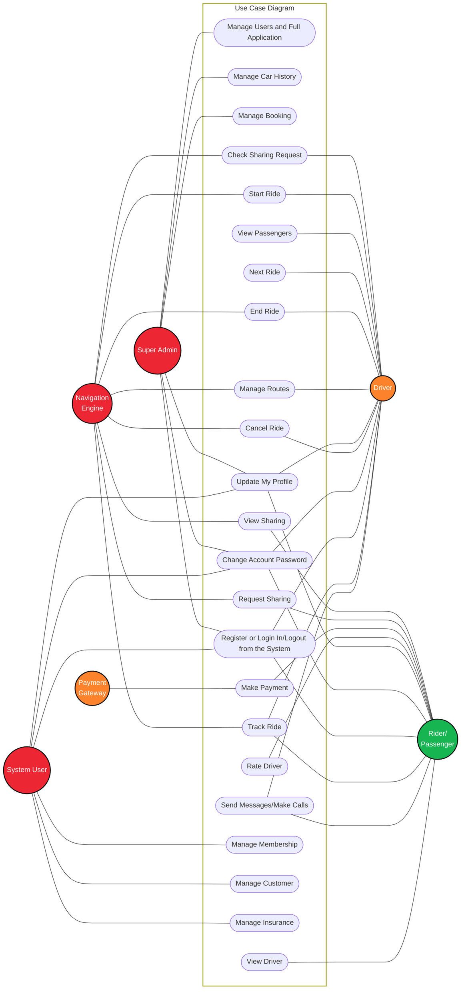
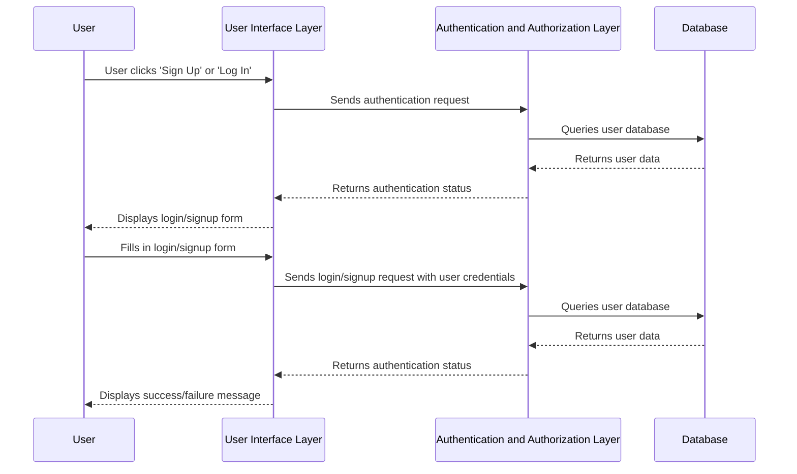

 
 

<h1 align="center" >

<b>Ride Sharing Service</b>

</h1>
 
Get dynamically generated GitHub stats!

  
  
  
  
   

---

## Table of Contents
1. <a id="introduction-1">[Introduction](#introduction)</a>
1. <a id="business-requirements-1">[Business Requirements](#business-requirements)</a>
1. <a id="stakeholder-analysis-1">[Stakeholder Analysis](#stakeholder-analysis)</a>
1. <a id="system-context-1">[System Context](#system-context)</a>
1. <a id="architecture-components-1">[Architecture Components](#architecture-components)</a>
1. <a id="functional-requirements-1">[Functional Requirements](#functional-requirements)</a>
   - <a id="Essential-1">[Essential Requirements of Driver Interface](#Essential)</a>
   - <a id="essentialDriver-1">[Essential Requirements of Driver Interface](#essentialDriver)</a>
   - <a id="essentialAdmin-1">[Essential Requirements of Admin Interface](#essentialAdmin)</a>
1. <a id="viewpoint-1">[Architecture Views](#viewpoint)</a>
   - <a id="use-case-viewpoint-1">[Use Case Viewpoint](#use-case-viewpoint)</a>
   - <a id="logical-viewpoint-1">[Logical Viewpoint](#logical-viewpoint)</a>
   - <a id="functional-viewpoint-1">[Sequence Diagram for Taxi Booking System](#functional-viewpoint)</a>
   - <a id="process-viewpint-1">[Process Viewpint](#process-viewpint)</a>
   - <a id="context-viewpoint-1">[Context Viewpoint](#context-viewpoint)</a>
1. <a id="architecture-patterns-1">[Architecture Patterns](#architecture-patterns)</a>
1. <a id="Components-1">[Components:](#Components)</a>
1. <a id="data-managment-1">[Data Management:](#data-managment)</a>
1. <a id="quality-attribute-1">[Performance and Scalability](#quality-attribute)</a>
   - <a id="consistency-1">[Consistency](#consistency)</a>
   - <a id="availability-1">[Availability](#availability)</a>
   - <a id="scalability-1">[Scalability](#scalability)</a>
   - <a id="flexibility-1">[Flexibility](#flexibility)</a>
   - <a id="security-1">[Security](#security)</a>
   - <a id="performance-1">[Performance](#performance)</a>
1. <a id="securityPrivacy-1">[Security and Privacy](#securityPrivacy)</a>
1. <a id="deployment-1">[Deployment](#deployment)</a>
1. <a id="technicaldebt-1">[Technical Debt](#technicaldebt)</a>
1. <a id="conclusion-1">[Conclusion](#conclusion)</a>
1. <a id="references-1">[References](#references)</a>
1. <a id="appendix-1">[Appendix](#appendix)</a>

# <a id='introduction'>[Introduction](#introduction-1)</a>

The ride-sharing industry has exploded in popularity in recent years, with services such as `Uber`, `Lyft`, and `Grab` becoming ubiquitous in cities around the world. These services offer a new and convenient way for people to get around, using a combination of technology and transportation to connect riders with drivers. However, designing and implementing a successful ride-sharing service is no simple feat, and requires careful consideration of a wide range of `technical`, `logistical`, and `social` factors.

This software architecture document aims to provide a detailed overview of the architecture of a `ride-sharing service`, including the key components and systems involved in its operation. This document is intended for `developers`, `architects`, and `stakeholders` who are involved in the `development` or `management` of a ride-sharing service, and who need to understand the technical aspects of the service in order to make informed decisions.

The document will begin by providing an overview of the `ride-sharing industry`, including the key players and trends that have emerged in recent years. This will be followed by a detailed description of the architecture of a `typical ride-sharing service`, including the key components such as the `rider app`, `driver app`, and `backend systems`. The document will also cover topics such as `data privacy` and `security`, `scalability` and `performance`, and `integration` with `third-party` services.

Overall, this document aims to provide a comprehensive and practical guide to the architecture of a ride-sharing service, with a focus on the technical considerations and challenges involved in designing and operating such a service. By providing a clear and detailed understanding of the key systems and components involved in a ride-sharing service, this document will help developers and `stakeholders` to make informed decisions and build successful ride-sharing services that meet the needs of `riders`, `drivers`, and `other stakeholders`.

 
 

### 
System overview

# <a id="business-requirements">[Business Requirements](#business-requirements-1)</a>

Before we dive deeper into the architecture of the ride-sharing service, let's first define the business requirements. The ride-sharing service should meet the following requirements:

|                      Requirements | Descriptions                                                                                                                                                                                                            |
| --------------------------------: | :---------------------------------------------------------------------------------------------------------------------------------------------------------------------------------------------------------------------- |
| Passenger and Driver Registration | The service should allow passengers and drivers to easily `register` and `create` accounts.                                                                                                                             |
|                     Ride Requests | Passengers should be able to `request rides` using the `app`, specifying their `pickup` and `dropoff locations`, and the `type of vehicle` they want. Drivers should receive notifications of `incoming ride requests`. |
|                 Driver Acceptance | Drivers should be able to `accept` or `reject` ride requests based on their availability.                                                                                                                               |
|                        Navigation | The app should provide `navigation` instructions to the pickup and dropoff locations for both passengers and drivers.                                                                                                   |
|                Real-Time Tracking | Passengers should be able to track the driver's location in `real-time`.                                                                                                                                                |
|                Payment Processing | The service should process payments `securely` and `efficiently`, handling `refunds`, `chargebacks`, and `disputes`.                                                                                                    |
|               Ratings and Reviews | Passengers and drivers should be able to `rate` each other and leave `reviews`.                                                                                                                                         |
|                  Customer Support | The service should provide `customer support` to handle `issues` and `complaints`.                                                                                                                                      |
|                    Reducing costs | Companies aim to optimize their operations to `reduce costs`, including driver `acquisition` and `retention`, `maintenance of vehicles`, and `marketing expenses`.                                                      |

Now that we have defined the business requirements, let's move on to the `architecture of the ride-sharing` service.

# <a id="stakeholder-analysis">[Stakeholder Analysis](#stakeholder-analysis-1)</a>

In the case of a ride-sharing service, `stakeholders` can include a wide range of individuals or groups who have an `interest` or `investment` in the success of the service. Some examples of stakeholders in a ride-sharing service might include:

|   Stackeholder | Analysis                                                                                                                                                                                                                               |
| -------------: | :------------------------------------------------------------------------------------------------------------------------------------------------------------------------------------------------------------------------------------- |
|      Investors | Investors who have put `money` into the ride-sharing service and expect a return on their `investment`. These investors may include `venture capitalists`, `angel investors`, or `institutional investors`.                            |
|         Riders | People who use the ride-sharing service to get from one place to another. These individuals have a stake in the success of the service because they `rely` on it for `transportation`.                                                 |
|        Drivers | Individuals who work for the ride-sharing service and `provide rides` to `riders`. Drivers have a stake in the success of the service because their `livelihood` depends on it.                                                        |
| Administrators | People who are responsible for managing the ride-sharing service, including making `decisions about pricing`, `marketing`, and `customer support`.                                                                                     |
|     Regulators | `Government agencies` or other entities that have `regulatory authority` over the ride-sharing service. These regulators may have an interest in ensuring that the service operates in compliance with `local laws` and `regulations`. |
|    Competitors | Other companies that offer ride-sharing services and may be `impacted` by the success of the service.                                                                                                                                  |

Each stakeholder group may have different goals, interests, and `expectations` for the ride-sharing service, and it's important to consider their perspectives when designing the architecture of the service. By understanding the needs and goals of each stakeholder group, architects can design a ride-sharing service that meets the needs of everyone involved and is `well-positioned` for success.

In addition to the stakeholders who have a `positive interest` or investment in the success of the ride-sharing service, there may also be **`negative stakeholders`** who have concerns or objections to the service. Some examples of negative stakeholders in a ride-sharing service might include:

| Negative Stakeholders | Analysis                                                                                                                                                                                                                                                                                         |
| --------------------: | :----------------------------------------------------------------------------------------------------------------------------------------------------------------------------------------------------------------------------------------------------------------------------------------------- |
|        Taxi companies | Traditional taxi companies may see ride-sharing services as competition and may have negative opinions about the service. They may `lobby` against the service or try to `block` its entry into certain `markets`.                                                                               |
|     Local governments | Some local governments may have concerns about the impact of ride-sharing services on `traffic congestion`, `public safety`, and `revenue` from traditional taxi and transportation fees. They may `impose regulations` or taxes on the service that `increase costs` or `limit` its operations. |
|          Labor unions | Labor unions may have concerns about the working conditions and wages of ride-sharing service drivers. They may lobby for `greater protections` or regulations that `limit the flexibility` or earning `potential` of drivers.                                                                   |
|  Environmental groups | `Environmental groups` may be concerned about the impact of ride-sharing services on `air quality` and `carbon emissions`. They may advocate for `alternative transportation` solutions or `policies` that limit the use of ride-sharing services.                                               |
|     Privacy advocates | `Privacy advocates` may have concerns about the collection and use of user data by ride-sharing services. They may `advocate for greater privacy protections` or `transparency around` how user data is collected and used.                                                                      |

Understanding the concerns and `objections of negative stakeholders` is important in designing a ride-sharing service that is `sustainable` and `responsive` to the needs of all stakeholders. By considering the perspectives of both positive and negative stakeholders, architects can design a ride-sharing service that addresses concerns and objections while still meeting the needs of `riders`, `drivers`, `investors`, and other `positive stakeholders`.

# <a id="system-context">[System Context](#system-context-1)</a>

The ride-sharing service operates within a larger system context, consisting of various external systems, interfaces, and communication protocols. The following diagram illustrates the system context of the ride-sharing service:

 

As shown in the diagram, the ride-sharing service is connected to various external services, including user devices, a payment gateway, a mapping service, a push notification service, and an analytics service. The ride-sharing service communicates with these external services through various interfaces and protocols, such as HTTP, HTTPS, and REST.

User devices, such as mobile phones and tablets, are the primary interface for riders and drivers to interact with the ride-sharing service. They provide access to the ride-sharing app and enable users to request and accept rides, track ride status, and handle payments.

The payment gateway service processes payments made by riders and drivers, handling transactions securely and efficiently. The mapping service provides real-time location data and navigation services, allowing riders and drivers to optimize their routes and minimize travel time.

The push notification service sends real-time notifications to users about ride status updates, payment confirmations, and other relevant information. The analytics service collects and analyzes data on ride usage, user behavior, and service performance, providing insights to improve the quality and efficiency of the ride-sharing service.

The ride-sharing service is deployed on the internet and relies on various internet technologies, such as DNS, load balancers, firewalls, and security protocols, to ensure secure and reliable service delivery.

# <a id="architecture-components">[Architecture Components](#architecture-components-1)</a>

This Component diagram depicts the Car Sharing System, illustrating its components and the interfaces, ports, and relationships between them. It is a powerful tool used in Component-Based Development (CBD) to describe systems with Service-Oriented Architecture (SOA).

The Car Sharing System UML component diagram provides a comprehensive view of the organization and wiring of the physical components in the system. Its primary objective is to convey a clear and concise representation of the system's structure and its interrelationships.

The Car Sharing System is composed of several components, including the `Payment Component`, `Booking Component`, `Destination Component`, `Customer Component`, and `Insurance Component`. Each of these components plays a crucial role in the overall system, and they work together seamlessly to ensure that the Car Sharing System provides a reliable, efficient, and safe service to its users.

| Component | Descripiton|
| ---: | :--- |
|Payment Component|The Payment Component is responsible for managing the payment transactions between the user and the system. It ensures secure and efficient processing of payment details and charges the user for each ride.|
|Booking Component|The Booking Component handles the ride booking process, including ride requests, driver assignment, and fare calculation. It is responsible for ensuring that rides are assigned to the most suitable driver and that the user is charged an appropriate fare.|
|Customer Component|Destination ComponentThe Destination Component is responsible for providing accurate and reliable destination information to the user. It tracks the location of drivers and users and provides distance and time estimates for rides.|
|Customer Component|The Customer Component manages the user's account, including their profile, ride history, and preferences. It ensures that users have a smooth and seamless experience while using the Car Sharing System.
|Insurance Component|The Insurance Component provides insurance coverage for the Car Sharing System. It ensures that users and drivers are protected in case of accidents or other incidents.|

The Car Sharing System Component diagram is a valuable tool for modeling and understanding the Car Sharing System's physical components, their relationships, and their interactions. It can help developers and system architects identify potential issues early in the design process and ensure that the system is designed to meet the needs of its users.
 
 

### 
Architecture Component Diagram

# <a id="functional-requirements">[Functional Requirements](#functional-requirements-1)</a>

## <a id="Essential">[Essential Requirements of Driver Interface](#Essential-1)</a>

| Rider/Passenger Interface | Requirements                                                                                                                                                                      |
| ------------------------: | :-------------------------------------------------------------------------------------------------------------------------------------------------------------------------------- |
|              Registration | Riders can `register` or sign in via `email` and `social media`. They can also register for different `payment methods`.                                                          |
|              Taxi Booking | The riders can book a taxi, enter their address, select the type of car, and adjust the pickup location.                                                                          |
|           Fare Calculator | The fare for traveling from point A to point B is automatically calculated based on the number of kilometers, the type of car chosen, current fuel rates, estimated traffic, etc. |
|             Ride Tracking | The driver’s location is tracked in Real-time based on which timely updates on traffic, travel routes, and the estimated time of arrival is provided to the rider.                |
|                   Payment | Cashless and in-app payment features are at the rider’s disposal. They can choose from various options, including credit cards, debit cards, net banking, PayPal, etc.            |
|       Messaging & Calling | Messages and calls to the rider providing the status of their ride.                                                                                                               |
|  Driver Rating & Analysis | Provide driver rating based on the journey, taken route, car comfort, driver’s behavior, etc.                                                                                     |
|            Travel History | The track record of the previous rides and transactions.                                                                                                                          |
|         Ride Cancellation | The rider has the option of canceling the ride, but needs to be done within a specified time limit to avoid paying the cancellation fee.                                          |
|             Split Payment | Riders also can opt to share a ride with other passengers.                                                                                                                        |
|        Schedule for Later | This feature allows the riders to book a ride in advance.                                                                                                                         |
|           Book for Others | Using this feature, one can also book a taxi for their friends, relatives, colleagues, etc.                                                                                       |

## <a id="essentialDriver">[Essential Requirements of Driver Interface](#essentialDriver-1)</a>

|   Driver Interface Requirements | Description                                                                                                                                                                                                       |
| ------------------------------: | :---------------------------------------------------------------------------------------------------------------------------------------------------------------------------------------------------------------- |
|         Driver Profile & Status | This feature gives the complete information of the driver, for example: if he/she is verified or not, their license, car insurance, etc. The driver’s availability status is also displayed through this feature. |
|                      Trip Alert | The driver would be notified for incoming ride requests, information on the destination, pickup location, travel route, and rider’s necessary details.                                                            |
|              Push Notifications | Notifications are received when the ride commences, any change in the travel route, heavy traffic ahead and on the completion of the ride                                                                         |
| Navigation & Route Optimization | The driver uses this feature to navigate the traffic, opt for the shortest way to the destination using the Google Maps                                                                                           |
|                         Reports | Provide insights regarding trips and earnings on a daily/weekly/monthly basis                                                                                                                                     |
|                    Waiting time | The rider would be charged extra if the waiting period exceeds 5minutes.                                                                                                                                          |
|                       Next Ride | The ride is notified of an upcoming ride while he/she is still completing the previous one.                                                                                                                       |

## <a id="essentialAdmin">[Essential Requirements of Admin Interface](#essentialAdmin-1)</a>

An Admin panel is crucial for the proper integration and smooth functioning of the system.
The basic features and functionalities of an Admin panel would be:

|                 Admin Interface Requirements | Description                                                                                                                                                                                                                                       |
| -------------------------------------------: | :------------------------------------------------------------------------------------------------------------------------------------------------------------------------------------------------------------------------------------------------ |
| Customer and Driver Details Management (CRM) | This feature enables the admin to manage and update the customer and driver details, including their personal information, contact information, and payment details. It helps the admin to keep track of their users and maintain their database. |
|                           Booking Management | Booking management feature is used to manage all the bookings made by customers. It allows the admin to view, update, and cancel the bookings. The admin can also assign drivers for the bookings and keep track of the booking status.           |
|    Vehicle Detail Management (if self-owned) | If the business owns its vehicles, the admin should be able to manage all the vehicle details, including registration details, insurance, and maintenance records.                                                                                |
|                Location and Fares Management | The admin panel should have a feature to manage the fare and location details. It allows the admin to update the fare prices and add new locations as required.                                                                                   |
|                       Call System Management | This feature enables the admin to manage the call system, including call recording and call logs. It helps the admin to track the customer support calls and provide better service.                                                              |
|                                Communication | Admin should be able to communicate with the customers and drivers using various channels such as email, SMS, and push notifications. It helps to keep the users informed about any updates or changes in the service.                            |
|                          Ratings and Reviews | The admin should be able to view and manage the ratings and reviews given by customers for the service. It helps to maintain the quality of the service and improve the customer satisfaction.                                                    |
|                     Promotions and Discounts | Admin should be able to create and manage the promotional offers and discounts for the users. It helps to attract new customers and retain the existing ones.                                                                                     |
|                           Payroll Management | If the business employs drivers or other staff, the admin should be able to manage their payroll details, including salary, incentives, and deductions.                                                                                           |
|                           Content Management | The admin should be able to manage the content on the website or app, including text, images, and videos. It helps to keep the content up-to-date and relevant.                                                                                   |
|                    Customer Support and Help | Admin should be able to provide customer support and help to the users. It helps to resolve any issues or queries raised by the users and improve the overall service quality.                                                                    |

### Admin Interface Requirements Diagram:

# <a id="viewpoint">[Architecture Views](#viewpoint-1)</a>

## <a id="use-case-viewpoint">[Use Case Viewpoint](#use-case-viewpoint-1)</a>

Ride sharing services have become a popular mode of transportation for people all over the world. They offer an affordable and convenient way to get around, and can be accessed through a variety of platforms, including mobile apps and websites. In this Use Case Viewpoint, we will examine the different use cases for ride sharing services, including how they are used by passengers and drivers.

### Actors:

These actors play a crucial role in the ride sharing service use case. The primary users (Rider, Ride Sharing Company, and Driver) are responsible for the core functionality of the service, while the secondary users (GPS, Navigation Engine, and Payment Gateway) provide supporting functions to ensure that the ride is completed efficiently and securely.

### Primary users:

|         Primary user | Description                                                                  |
| -------------------: | :--------------------------------------------------------------------------- |
|                Rider | A person who needs a ride from one location to another.                      |
|               Driver | A person who provides a ride to a rider using their own vehicle.             |
| Ride Sharing Company | The organization that provides the ride sharing service and manages the API. |

### Secondary users:

|                 Secondary users | Description                                                                                                                                                                                                                                                                           |
| ------------------------------: | :------------------------------------------------------------------------------------------------------------------------------------------------------------------------------------------------------------------------------------------------------------------------------------ |
| GPS (Global Positioning System) | GPS is an actor that is responsible for providing real-time location data to the ride sharing service.                                                                                                                                                                                |
|               Navigation Engine | Navigation Engine is an actor that provides route guidance to the driver during the ride. The use case of Navigation Engine involves providing real-time traffic information, suggesting alternate routes, and providing turn-by-turn directions to the driver.                       |
|                 Payment Gateway | Payment Gateway is an actor that facilitates the transaction between the rider and the ride sharing service. The use case of Payment Gateway involves securely processing the payment information, verifying the transaction, and transferring the funds to the ride sharing service. |

### Use Cases:

This Use Case Diagram is a graphic depiction of the interactions among the elements of Car Sharing System. It represents the methodology used in system analysis to identify, clarify, and organize system requirements of Car Sharing System. The main actors of Car Sharing System in this Use Case Diagram are: Super Admin, System User, Customer, Driver, who perform the different type of use cases such as Manage Booking, Manage Customer, Manage Payment, Manage Car History, Manage Insurance, Manage Memebership, Manage Destination, Manage Users and Full Car Sharing System Operations.

Major elements of the UML use case diagram of Car Sharing System are shown on the picture below:

<!-- 

    
 Major elements of the UML use case diagram of  Car Sharing System are shown on the picture below: 

<!-- empty line -->
<!-- 

    

 -->
<!-- empty line -->

The relationships between and among the actors and the use cases of Car Sharing System:

<!-- **Super Admin Entity** : Use cases of Super Admin are Manage Booking, Manage Customer, Manage Payment, Manage Car History, Manage Insurance, Manage Memebership, Manage Destination, Manage Users and Full  Car Sharing System Operations

**System User Entity**  : Use cases of System User are Manage Booking, Manage Customer, Manage Payment, Manage

**Customer Entity** : Use cases of Customer are Request Sharing, View Sharing, Make Payment, View Payment History

**Driver Entity**  : Use cases of Driver are Check Sharing Request, View Passengars, Manage Routes, Collect Payments -->

1. Request a Ride
   - Rider opens the ride sharing service app and enters their destination.
   - Ride sharing service uses GPS to determine the rider's location and matches the rider with an available driver who is nearby and notifies the driver of the request.
   - Driver accepts the ride request and the Navigation Engine provides turn-by-turn directions to navigate to the pick-up location.
1. Start Ride
   - Driver picks up the rider at the pick-up location.
   - Driver starts the ride in the app to begin tracking the distance and time of the ride using GPS.
   - Navigation Engine provides turn-by-turn directions to the destination.
1. End Ride
   - Driver completes the ride in the app when they arrive at the destination.
   - Rider confirms that the ride has ended and pays for the ride through the app, with GPS being used to calculate the fare based on distance and time.
   - GPS is used to track the vehicle's location and calculate the fare.
   - Navigation Engine provides the driver with the most efficient route to the destination, which helps to reduce the time and distance of the ride.
1. Cancel Ride
   - Rider cancels the ride request before the driver arrives.
   - Ride sharing service cancels the ride and notifies the driver, with GPS being used to update the driver's location.
   - Navigation Engine provides the driver with updated directions to their next destination.
1. Update Ride Details
   - Rider updates the pick-up location or destination of the ride request before the driver arrives.
   - Ride sharing service updates the ride details and notifies the driver, with GPS being used to update the driver's route and estimated time of arrival.
   - Navigation Engine provides the driver with updated directions to the new destination.
1. Rate Driver
   - Rider rates the driver on a scale of 1 to 5 stars after the ride is complete.
   - Ride sharing service records the rating and uses it to inform future ride matches, with GPS being used to track the driver's location and route during the ride.
1. Report Issue
   - Rider reports an issue with the ride, such as poor driving or unsafe conditions.
   - Ride sharing service records the report and investigates the issue, with GPS being used to track the vehicle's location and route during the ride.
1. View Ride History
   - Rider and driver can view their past ride history in the app, including the pick-up and drop-off locations, distance, time, fare, and rating, with GPS being used to track the vehicle's location and route during the ride.
1. Manage Account
   - Rider and driver can manage their account details, such as payment information and personal information, through the app.

## <a id="logical-viewpoint">[Logical Viewpoint](#logical-viewpoint-1)</a>

A logical view of a ride-sharing service can be represented as a layered architecture. Layer Design is a common approach used to design complex systems, which involves breaking down the system into several layers, with each layer responsible for a specific set of functionalities. As domains move from lower to higher layers, they impact fewer services in the case of an outage and represent more specific product use cases. This approach ensures that the system is modular, scalable, and easy to maintain.

|                      Logical Viewpoint | Description                                                                                                                                                                                                                                                          |
| -------------------------------------: | :------------------------------------------------------------------------------------------------------------------------------------------------------------------------------------------------------------------------------------------------------------------- |
|                   Edge layer | The Edge Layer is the gateway that safely exposes user functionality to the outside world, including mobile apps and other clients. This layer provides a secure boundary between the outside world and the rest of the system, protecting it from potential security threats.  |
|                    Presentation Layer | The Presentation Layer serves client-specific use cases in ride-sharing service client apps. It provides an interface between the client and the rest of the system, enabling communication between the two. This layer uses API technology options such as Resource Oriented APIs, WebSockets, GraphQL, and gRPC. |
|              Product Layer | The Product Layer houses services and functionalities that enable line-of-business-specific use cases, such as Mobility, Delivery, and Freight. These functionalities are designed to meet the specific requirements of each line of business and provide value-added services to users. |
|                 Business Layer | The Business Layer provides common, core functionality that ride-sharing services can use for any product or use case. These functionalities are generic and are not specifically designed for a particular line of business. Examples of functionalities in this layer include user authentication, authorization, and data validation.  |
|                Infrastructure Layer |The Infrastructure Layer provides shared platform infrastructure components, like networking, streaming, storage, machine learning, and AI infrastructure. This layer provides the underlying infrastructure necessary to support the system's functionalities and ensure its scalability and reliability.   |

 

Layer Design

In conclusion, a layer design approach enables the ride-sharing system to be modular, scalable, and easy to maintain. Each layer is independent of the other layers, communicates through well-defined interfaces, and provides specific functionalities that cater to the system's needs. This design approach ensures that the ride-sharing system can meet the requirements of different lines of business and provide value-added services to users.

 

## <a id="functional-viewpoint">[Sequence Diagram for Taxi Booking System](#functional-viewpoint-1)</a>

 
 

This diagram shows the lifelines of a taxi booking system and the interactions between them. It shows the process of ordering a taxi ride. A rider can choose a pick-up point, destination, and time of pick up.

    

 
The diagram shows these lifelines:

- Rider
- Rider App
- Management Server
- Driver App
- Driver

There are these interactions between the lifelines:

- Choose a pick-up point
- Choose destination
- (Optional) Later transfer
- Choose time
- (Loop) Order is not accepted and the customer does not close app
  - Confirm order
  - Send order
  - Find free drivers
  - Send order notification to free drivers
  - Show order notification
  - (Optional) No taxi driver available
    - Choose extra fee
- (Alternative 1) Taxi driver interested
  - Accept the order
  - Send acceptance
  - Notify acceptance
- (Alternative 2)Taxi driver not interested
  - Reject the order
  - Send rejection
  - Notify rejection
- (Loop) Rider is waiting for the taxi
  - Send GPS coordinates of the taxi vehicle
  - Retrieve GPS coordinates of taxi vehicle
  - Show location of taxi vehicle on the map
  - Send GPS coordinates of the customer
  - Retrieve GPS coordinates of the customer
  - Show customer location on the map

|  components  | Description                                                                                                                                                                                                                           |
| -------------: | :------------------------------------------------------------------------------------------------------------------------------------------------------------------------------------------------------------------------------------- |
|      Web Application Firewall (WAF) | Use for Security purposes. Here we can block the requests from the blocked IPs, Bots, and regions which is not supported by Uber.                            |
|          Load Balancer  | Here we can use different layers of Load balancers like Layer 3, Layer4, and Layer 7. Layer 3 works based on IP based Load Balancer(All the IPs for traffic go Layer3 Load balancer. In the Layer4 we can use DNS based Load Balancing. In Layer7 works based on Application-level Load Balancing)                                                |
|        KAFKA REST API | This will provide an endpoint to consume all the location data for every Cab. Example: We have 1000 Cabs running for a City and every 4 sec we are sending a location that means every 4 sec we have 1000 locations been sending for KAFKA REST API. Those locations will be sent to DISCO to keep the states alive.                                                        |
| WEB SOCKET | Unless normal HTTP requests web sockets are really helpful for these kinds of Applications. Because we need synchronize way to sending messages from Client to the Server and Server to the Client at any given point of the time. We should have a connection established between the Cab Application to the Server or The User to the Server. Web Socket keeps the connection opens for all of the Uber Application and based on the changes that happen in the DISCO or any component in the server the data will be exchanged between the Application and the Server. Mainly written in NodeJS(Asynchornize and event-driven framework).                                     |
|     DISCO Component | Dispatch System is mainly written in NodeJS. So that server can send/push the messages to the Application whenever it wants.                                                                                                 |
                                              

## <a id="process-viewpint">[Process Viewpint](#process-viewpint-1)</a>

    

## 

## <a id="context-viewpoint">[Context Viewpoint](#context-viewpoint-1)</a>

    

# <a id="architecture-patterns">[Architecture Patterns](#architecture-patterns-1)</a>

# <a id="Components">[Components:](#Components-1)</a>

# <a id="data-managment">[Data Management:](#data-managment-1)</a>

# <a id="quality-attribute">[Performance and Scalability](#quality-attribute-1)</a>

## <a id="consistency">[Consistency](#consistency-1)</a>

Mission-critical applications such as financial dashboards require data to be consistent across all regions. This includes zero data loss in the inter-region and intraregional dispersal and processing mechanisms, de-duplication as well as ability to certify data quality.

## <a id="availability">[Availability](#availability-1)</a>

The real time data infrastructure stack must be highly available with 99.99 percentile guarantee. Loss of availability has a direct impact on ride sharing business and may result in significant financial losses. For instance, dynamic pricing leverages the real-time data infrastructure component for calculating demand and supply ratios per geo-fence, which in turn is used to influence the price of a trip.

## <a id="scalability">[Scalability](#scalability-1)</a>

The raw data streams constitute petabytes of data volume collected per day across all regions. This data is constantly growing based on organic growth of our user base, new lines of business deployed by ride sharing company as well as new real time analytics use cases that arise over time. The ability to scale with this ever-growing data set in a seamless manner, without requiring users to re-architect the processing pipelines is a fundamental requirement of the real-time data infrastructure stack.

## <a id="flexibility">[Flexibility](#flexibility-1)</a>

We need to provide programmatic as well as declarative (SQL like) interface for expressing computational logic to accommodate the diverse user groups. In addition, some use cases need a push-based model which is semi stateful and continuously emits generated results whereas others might need a stateful pull-based model where the user can execute queries on the raw data stream. For instance, users can create intelligent alerts in case of business rule violation using push-based stream processing pipelines. Whereas, dashboarding and triaging will require a pull-based SQL interface for the same datasets.

## <a id="security">[Security](#security-1)</a>

This system has multistep security. The user needs to login to the system every time by providing a password and user ID, and the login session will time out after every 2 minutes to ensure high security. When the passenger pays the bill, they need to again give the password. All of those steps will keep their bank card and payment information secure. In bellow see full description about security.

Basic security behaviors:
|Security behaviors|Description|
|---: | :---|
|Authentication | Login using at least a user name and a password.|
|Authorization | according to their profile, online user must be granted or not allowed to receive some specific services (Automatic match finding, Ride Suggestion, etc...)|
|Confidentiality | sensitive data must be encrypted if any (credit card payments).|
|Safety | Credit card data must not be kept at a local database.
|Data integrity | Data sent across the network cannot be modified by a tier.|
|Auditing | Every sensitive action can be logged.|
|Non-repudiation | gives evidence a specific action occurred.|

## <a id="performance">[Performance](#performance-1)</a>

This system has high performance ability. Passengers can book a taxi and search for availability in a short period of time. Admin can update the bike taxi list. Search queries should return 90% of the time below 5 seconds. The credit card payment transaction should finish in 10 seconds.

# <a id="securityPrivacy">[Security and Privacy](#securityPrivacy-1)</a>

# <a id="deployment">[Deployment](#deployment-1)</a>

# <a id="technicaldebt">[Technical Debt](#technicaldebt-1)</a>

Technical debt refers to the costs that arise from taking shortcuts or making trade-offs during the development process of software or technology systems. The ride-sharing service industry is no exception, and there are several areas where technical debt can accumulate.

One major area of technical debt in ride-sharing services is in the development of the mobile applications that riders and drivers use to request and provide rides. These apps must handle large amounts of data and complex algorithms in real-time, and shortcuts or compromises in the code can lead to bugs, crashes, and security vulnerabilities.

Another area of technical debt in ride-sharing services is in the infrastructure that supports the services. This includes the servers and databases that store user information and ride data, as well as the network infrastructure that connects riders and drivers. Failure to properly design and maintain this infrastructure can lead to system downtime, data loss, and security breaches.

Finally, ride-sharing services face technical debt in the area of regulatory compliance. The laws and regulations governing ride-sharing services vary by jurisdiction, and it can be challenging to keep up with changes and ensure that the service is in compliance with all applicable laws.

Ride-sharing services are no exception and may face various technical debt challenges, including:
|Technical Debt Challenges | Description|
|---: | :---|
|Legacy systems | As ride-sharing services expand, they often acquire new technologies and integrate them into their existing systems, leading to a more complex and difficult-to-maintain infrastructure.|
|Scalability | As the user base of ride-sharing services grows, the system must be able to handle the increased traffic and demand. This can lead to issues such as slow response times and downtime.|
|Security | With sensitive user data being shared on ride-sharing platforms, security must be a top priority. Any security breaches can result in severe consequences, including legal action and damage to the brand's reputation.|
|Technical infrastructure | Ride-sharing services require a sophisticated technical infrastructure to function, including GPS technology, payment processing systems, and real-time communication channels. The maintenance and upgrading of this infrastructure can be costly and time-consuming.|
|Integration with third-party services | Ride-sharing services often integrate with other third-party services such as mapping and payment platforms. This can lead to issues with compatibility and system stability.|

Overall, technical debt is a significant concern for ride-sharing services, and it requires ongoing attention and investment to ensure that the service remains stable, secure, and compliant with all relevant regulations. Technical debt in ride-sharing services requires a long-term approach and a commitment to ongoing maintenance and improvement. Regular updates and upgrades can help to improve system scalability, security, and user experience, while reducing technical debt over time.

# <a id="conclusion">[Conclusion](#conclusion-1)</a>

The ride-sharing service industry has revolutionized the way people travel, and its popularity continues to grow worldwide. In conclusion, ride-sharing services offer numerous benefits, including convenience, affordability, and reduced environmental impact.

These services have also provided new income opportunities for drivers, allowing them to work flexible hours and earn additional income. However, there are also potential drawbacks, such as concerns over safety and security, and the impact on traditional taxi and public transportation services.

Overall, the future of ride-sharing services looks promising, with continued innovation and improvements in technology expected to further enhance the user experience and address any remaining concerns.

# <a id="references">[References](#references-1)</a>

1. Zheng, Y., Li, Q., Chen, Y., Xie, X., & Ma, W. (2018). A survey of ride sharing. Transportation Research Part C: Emerging Technologies, 96, 380-393.
1. Wang, X., Guo, Y., Huang, M., & Yu, B. (2019). A novel group decision-making method based on multi-attribute decision-making for ride-sharing. IEEE Access, 7, 45899-45907.
1. Sun, X., Zhang, W., & Wang, Y. (2018). Ride sharing in autonomous vehicle era: A survey. IEEE Transactions on Intelligent Transportation Systems, 19(12), 3808-3823.
1. D. D. S. Gopala Rao, S. Bhowmick, K. Desai and M. Shukla, "A Systematic Survey of Real-Time Ridesharing: From User Behaviour to Future Directions," in IEEE Transactions on Intelligent Transportation Systems, vol. 22, no. 7, pp. 4019-4042, July 2021.
1. Zhang, H., Wu, J., Liu, Y., Gu, X., & Xu, M. (2019). A spatiotemporal-sentiment-aware method for taxi ride-sharing. IEEE Transactions on Intelligent Transportation Systems, 20(10), 3827-3840.

# <a id="appendix">[Appendix](#appendix-1)</a>

**Appendix A:** Glossary - a list of definitions for key terms used in the document.

**Appendix B:** References - a list of sources used in the document, typically arranged alphabetically by author's last name.

**Appendix C:** Survey Results - data or statistics from a survey that was conducted as part of the research for the document.

**Appendix D:** Technical Specifications - detailed technical information related to the implementation or design of a system or product.

**Appendix E:** User Manual - instructions for using a product or system.

**Appendix F:** Case Studies - examples or case studies that illustrate the concepts or principles discussed in the document.

**Appendix G:** Code Samples - code examples or snippets that demonstrate a particular programming technique or approach.

**Appendix H:** Budget - a detailed breakdown of the costs associated with a project or initiative.
