 
 
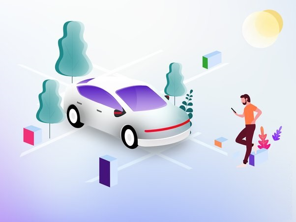

<h1 align="center" >

<b>Ride Sharing Service</b>

</h1>
 
Get dynamically generated GitHub stats!

  
  
  
  
   

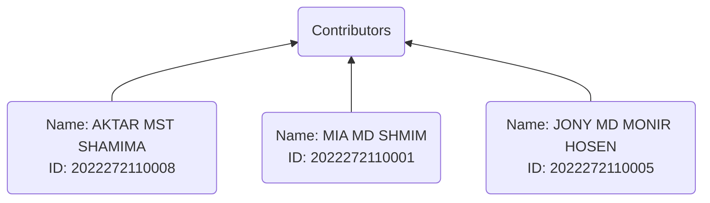

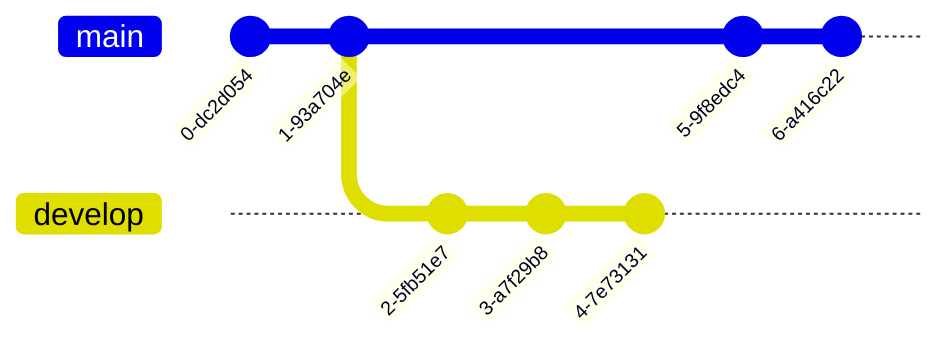

---

## Table of Contents

1. <a id="introduction-1">[Introduction](#introduction)</a>
1. <a id="business-requirements-1">[Business Requirements](#business-requirements)</a>
1. <a id="stakeholder-analysis-1">[Stakeholder Analysis](#stakeholder-analysis)</a>
1. <a id="quality-attribute-1">[Quality attributes](#quality-attribute)</a>
   - <a id="consistency-1">[Consistency](#consistency)</a>
   - <a id="availability-1">[Availability](#availability)</a>
   - <a id="scalability-1">[Scalability](#scalability)</a>
   - <a id="flexibility-1">[Flexibility](#flexibility)</a>
   - <a id="security-1">[Security](#security)</a>
   - <a id="performance-1">[Performance](#performance)</a>
1. <a id="key-1">[Key Quality Concerns](#key)</a>
1. <a id="system-context-1">[System Context](#system-context)</a>
1. <a id="architecture-components-1">[Architecture Components](#architecture-components)</a>
1. <a id="functional-requirements-1">[Functional Requirements](#functional-requirements)</a>
   - <a id="Essential-s-1">[Essential Requirements of Driver Interface](#Essential-s)</a>
   - <a id="essential-driver-1">[Essential Requirements of Driver Interface](#essential-driver)</a>
   - <a id="essential-admin-1">[Essential Requirements of Admin Interface](#essential-admin)</a>
1. <a id="viewpoint-1">[Architecture Views](#viewpoint)</a>
   - <a id="use-case-viewpoint-1">[Use Case Viewpoint](#use-case-viewpoint)</a>
   - <a id="logical-viewpoint-1">[Logical Viewpoint](#logical-viewpoint)</a>
   - <a id="functional-viewpoint-1">[Sequence Diagram for Taxi Booking System](#functional-viewpoint)</a>
   - <a id="process-viewpint-1">[Process Viewpint](#process-viewpint)</a>
   - <a id="context-viewpoint-1">[Context Viewpoint](#context-viewpoint)</a>
   - <a id="deployment-1">[Deployment Viewpoint](#deployment)</a>
1. <a id="database-devel-1">[Database Development](#database-devel)</a>
1. <a id="architecture-patterns-1">[Architecture Patterns](#architecture-patterns)</a>
1. <a id="data-managment-1">[Architecture Decisions ](#data-managment)</a>
1. <a id="conclusion-1">[Conclusion](#conclusion)</a>
1. <a id="references-s-1">[References](#references-s)</a>

# <a id='introduction'>[Introduction](#introduction-1)</a>

The ride-sharing industry has exploded in popularity in recent years, with services such as `Uber`, `Lyft`, and `Grab` becoming ubiquitous in cities around the world. These services offer a new and convenient way for people to get around, using a combination of technology and transportation to connect riders with drivers. However, designing and implementing a successful ride-sharing service is no simple feat, and requires careful consideration of a wide range of `technical`, `logistical`, and `social` factors.

This software architecture document aims to provide a detailed overview of the architecture of a `ride-sharing service`, including the key components and systems involved in its operation. This document is intended for `developers`, `architects`, and `stakeholders` who are involved in the `development` or `management` of a ride-sharing service, and who need to understand the technical aspects of the service in order to make informed decisions.

The document will begin by providing an overview of the `ride-sharing industry`, including the key players and trends that have emerged in recent years. This will be followed by a detailed description of the architecture of a `typical ride-sharing service`, including the key components such as the `rider app`, `driver app`, and `backend systems`. The document will also cover topics such as `data privacy` and `security`, `scalability` and `performance`, and `integration` with `third-party` services.

Overall, this document aims to provide a comprehensive and practical guide to the architecture of a ride-sharing service, with a focus on the technical considerations and challenges involved in designing and operating such a service. By providing a clear and detailed understanding of the key systems and components involved in a ride-sharing service, this document will help developers and `stakeholders` to make informed decisions and build successful ride-sharing services that meet the needs of `riders`, `drivers`, and `other stakeholders`.

 
 

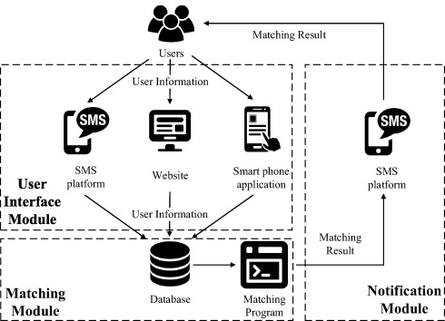

### 
Figure 1: System overview

# <a id="business-requirements">[Business Requirements](#business-requirements-1)</a>

Before we dive deeper into the architecture of the ride-sharing service, let's first define the business requirements. The ride-sharing service should meet the following requirements:

|                      Requirements | Descriptions                                                                                                                                                                                                            |
| --------------------------------: | :---------------------------------------------------------------------------------------------------------------------------------------------------------------------------------------------------------------------- |
| Passenger and Driver Registration | The service should allow passengers and drivers to easily `register` and `create` accounts.                                                                                                                             |
|                     Ride Requests | Passengers should be able to `request rides` using the `app`, specifying their `pickup` and `dropoff locations`, and the `type of vehicle` they want. Drivers should receive notifications of `incoming ride requests`. |
|                 Driver Acceptance | Drivers should be able to `accept` or `reject` ride requests based on their availability.                                                                                                                               |
|                        Navigation | The app should provide `navigation` instructions to the pickup and dropoff locations for both passengers and drivers.                                                                                                   |
|                Real-Time Tracking | Passengers should be able to track the driver's location in `real-time`.                                                                                                                                                |
|                Payment Processing | The service should process payments `securely` and `efficiently`, handling `refunds`, `chargebacks`, and `disputes`.                                                                                                    |
|               Ratings and Reviews | Passengers and drivers should be able to `rate` each other and leave `reviews`.                                                                                                                                         |
|                  Customer Support | The service should provide `customer support` to handle `issues` and `complaints`.                                                                                                                                      |
|                    Reducing costs | Companies aim to optimize their operations to `reduce costs`, including driver `acquisition` and `retention`, `maintenance of vehicles`, and `marketing expenses`.                                                      |

Now that we have defined the business requirements, let's move on to the `architecture of the ride-sharing` service.

# <a id="stakeholder-analysis">[Stakeholder Analysis](#stakeholder-analysis-1)</a>

In the case of a ride-sharing service, `stakeholders` can include a wide range of individuals or groups who have an `interest` or `investment` in the success of the service. Some examples of stakeholders in a ride-sharing service might include:

|   Stackeholder | Analysis                                                                                                                                                                                                                               |
| -------------: | :------------------------------------------------------------------------------------------------------------------------------------------------------------------------------------------------------------------------------------- |
|      Investors | Investors who have put `money` into the ride-sharing service and expect a return on their `investment`. These investors may include `venture capitalists`, `angel investors`, or `institutional investors`.                            |
|         Riders | People who use the ride-sharing service to get from one place to another. These individuals have a stake in the success of the service because they `rely` on it for `transportation`.                                                 |
|        Drivers | Individuals who work for the ride-sharing service and `provide rides` to `riders`. Drivers have a stake in the success of the service because their `livelihood` depends on it.                                                        |
| Administrators | People who are responsible for managing the ride-sharing service, including making `decisions about pricing`, `marketing`, and `customer support`.                                                                                     |
|     Regulators | `Government agencies` or other entities that have `regulatory authority` over the ride-sharing service. These regulators may have an interest in ensuring that the service operates in compliance with `local laws` and `regulations`. |
|    Competitors | Other companies that offer ride-sharing services and may be `impacted` by the success of the service.                                                                                                                                  |

Each stakeholder group may have different goals, interests, and `expectations` for the ride-sharing service, and it's important to consider their perspectives when designing the architecture of the service. By understanding the needs and goals of each stakeholder group, architects can design a ride-sharing service that meets the needs of everyone involved and is `well-positioned` for success.

In addition to the stakeholders who have a `positive interest` or investment in the success of the ride-sharing service, there may also be **`negative stakeholders`** who have concerns or objections to the service. Some examples of negative stakeholders in a ride-sharing service might include:

| Negative Stakeholders | Analysis                                                                                                                                                                                                                                                                                         |
| --------------------: | :----------------------------------------------------------------------------------------------------------------------------------------------------------------------------------------------------------------------------------------------------------------------------------------------- |
|        Taxi companies | Traditional taxi companies may see ride-sharing services as competition and may have negative opinions about the service. They may `lobby` against the service or try to `block` its entry into certain `markets`.                                                                               |
|     Local governments | Some local governments may have concerns about the impact of ride-sharing services on `traffic congestion`, `public safety`, and `revenue` from traditional taxi and transportation fees. They may `impose regulations` or taxes on the service that `increase costs` or `limit` its operations. |
|          Labor unions | Labor unions may have concerns about the working conditions and wages of ride-sharing service drivers. They may lobby for `greater protections` or regulations that `limit the flexibility` or earning `potential` of drivers.                                                                   |
|  Environmental groups | `Environmental groups` may be concerned about the impact of ride-sharing services on `air quality` and `carbon emissions`. They may advocate for `alternative transportation` solutions or `policies` that limit the use of ride-sharing services.                                               |
|     Privacy advocates | `Privacy advocates` may have concerns about the collection and use of user data by ride-sharing services. They may `advocate for greater privacy protections` or `transparency around` how user data is collected and used.                                                                      |

Understanding the concerns and `objections of negative stakeholders` is important in designing a ride-sharing service that is `sustainable` and `responsive` to the needs of all stakeholders. By considering the perspectives of both positive and negative stakeholders, architects can design a ride-sharing service that addresses concerns and objections while still meeting the needs of `riders`, `drivers`, `investors`, and other `positive stakeholders`.

# <a id="quality-attribute">[Quality Attribute](#quality-attribute-1)</a>

## <a id="consistency">[Consistency](#consistency-1)</a>

Mission-critical applications such as financial dashboards require data to be consistent across all regions. This includes zero data loss in the inter-region and intraregional dispersal and processing mechanisms, de-duplication as well as ability to certify data quality.

## <a id="availability">[Availability](#availability-1)</a>

The real time data infrastructure stack must be highly available with 99.99 percentile guarantee. Loss of availability has a direct impact on ride sharing business and may result in significant financial losses. For instance, dynamic pricing leverages the real-time data infrastructure component for calculating demand and supply ratios per geo-fence, which in turn is used to influence the price of a trip.

## <a id="scalability">[Scalability](#scalability-1)</a>

The raw data streams constitute petabytes of data volume collected per day across all regions. This data is constantly growing based on organic growth of our user base, new lines of business deployed by ride sharing company as well as new real time analytics use cases that arise over time. The ability to scale with this ever-growing data set in a seamless manner, without requiring users to re-architect the processing pipelines is a fundamental requirement of the real-time data infrastructure stack.

## <a id="flexibility">[Flexibility](#flexibility-1)</a>

We need to provide programmatic as well as declarative (SQL like) interface for expressing computational logic to accommodate the diverse user groups. In addition, some use cases need a push-based model which is semi stateful and continuously emits generated results whereas others might need a stateful pull-based model where the user can execute queries on the raw data stream. For instance, users can create intelligent alerts in case of business rule violation using push-based stream processing pipelines. Whereas, dashboarding and triaging will require a pull-based SQL interface for the same datasets.

## <a id="security">[Security](#security-1)</a>

This system has multistep security. The user needs to login to the system every time by providing a password and user ID, and the login session will time out after every 2 minutes to ensure high security. When the passenger pays the bill, they need to again give the password. All of those steps will keep their bank card and payment information secure. In bellow see full description about security.

Basic security behaviors:
|Security behaviors|Description|
|---: | :---|
|Authentication | Login using at least a user name and a password.|
|Authorization | according to their profile, online user must be granted or not allowed to receive some specific services (Automatic match finding, Ride Suggestion, etc...)|
|Confidentiality | sensitive data must be encrypted if any (credit card payments).|
|Safety | Credit card data must not be kept at a local database.
|Data integrity | Data sent across the network cannot be modified by a tier.|
|Auditing | Every sensitive action can be logged.|
|Non-repudiation | gives evidence a specific action occurred.|

## <a id="performance">[Performance](#performance-1)</a>

This system has high performance ability. Passengers can book a taxi and search for availability in a short period of time. Admin can update the bike taxi list. Search queries should return 90% of the time below 5 seconds. The credit card payment transaction should finish in 10 seconds.

# <a id="key">[Key Quality Concerns](#key-1)</a>

## Usability

Usability is a critical aspect of a ride-sharing service as it directly impacts the user experience and ultimately determines the success of the service. Here are some key considerations for improving the usability of a ride-sharing service:

1. User interface: The user interface (UI) should be intuitive and easy to use, with clear and concise instructions for each step of the ride-sharing process. The UI should also be visually appealing and responsive to user input.

1. Mobile optimization: As ride-sharing services are often accessed through mobile devices, the service should be optimized for mobile use. This includes ensuring that the UI is mobile-friendly, and that the app is fast, responsive, and easy to navigate.

1. Seamless booking process: The booking process should be quick and straightforward, with minimal user input required. Users should be able to book a ride with just a few clicks, and the app should provide real-time updates on the status of the ride.

1. Clear pricing information: Pricing information should be transparent and easy to understand, with no hidden fees or charges. Users should be able to see the cost of their ride upfront, and any changes to the cost should be clearly communicated.

1. Driver rating system: A driver rating system can help to ensure that users have a positive experience with the service by allowing them to rate their driver and provide feedback. This can also help to maintain a high level of service quality by holding drivers accountable for their performance.

1. Accessibility: The service should be accessible to users with disabilities, with features such as text-to-speech and voice commands to enable users with visual impairments to use the app.

1. Personalization: Personalization features such as favorite locations and ride preferences can improve the user experience by making it easier and more convenient for users to book rides.

By prioritizing these factors, a ride-sharing service can improve its usability, attract more users, and retain existing customers.

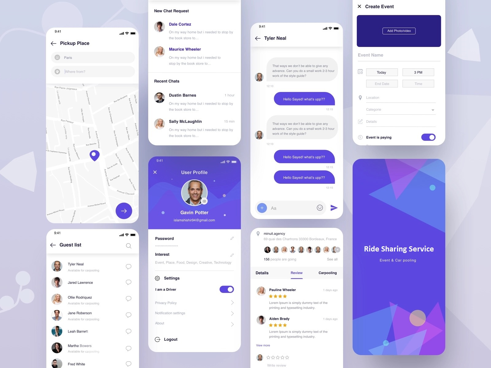

### 
Figure 2: Usability

## Security

From a ride-sharing service point of view, security and privacy are critical considerations to ensure the safety and trust of riders and drivers using the platform. The ride-sharing service should implement security measures to protect users' personal information, such as their name, address, phone number, and payment information, from unauthorized access or disclosure. This includes implementing encryption mechanisms during transmission and storage, access controls, and data backup and recovery procedures.

Additionally, the ride-sharing service should ensure that only authorized users can access the platform and its features through authentication and authorization mechanisms. This includes implementing secure login mechanisms, such as multi-factor authentication and password complexity, to prevent unauthorized access.

The ride-sharing service should also prioritize secure communication between the platform and its users, as well as external services. This includes implementing secure protocols such as TLS and ensuring that all third-party services meet appropriate security standards.

<ol>
  <li>
    <strong>Authentication and Authorization:</strong> The system should ensure that only authorized users can access the application and its features. This includes implementing secure login mechanisms, such as multi-factor authentication and password complexity.
  </li>
  <li>
    <strong>Data Security:</strong> The system should protect all data transmitted and stored in the application, including user information and ride data, against unauthorized access or modification. This includes implementing encryption mechanisms, access controls, and data backup and recovery procedures.
  </li>
  <li>
    <strong>Secure Communication:</strong> The system should ensure that all communication between the application and its users, as well as external services, is secure and encrypted. This includes implementing secure protocols, such as TLS, and ensuring that all third-party services used by the application meet appropriate security standards.
  </li>
  <li>
    <strong>Threat Monitoring:</strong> The system should monitor and respond to potential security threats, such as unauthorized access attempts or suspicious activity, to prevent security breaches. This includes implementing intrusion detection and prevention systems, as well as maintaining up-to-date security patches and software updates.
  </li>
</ol>
<ol>
  <li>
    <strong>Personal Data Protection:</strong> The system should protect the personal data of users from unauthorized access or disclosure. This includes encrypting sensitive data, such as user's name, address, phone number, and payment information, during transmission and storage.
  </li>
  <li>
    <strong>User Control:</strong> The system should allow users to control their data, including the ability to edit or delete their personal information and ride history.
  </li>
  <li>
    <strong>Transparency:</strong> The system should provide users with clear and concise information about how their data is collected, used, and shared within the system. Additionally, the system should be transparent about any data breaches or security incidents that may affect users' personal information.
  </li>
</ol>

In terms of privacy, the ride-sharing service should allow users to control their data, including the ability to edit or delete their personal information and ride history. The ride-sharing service should also be transparent about how users' data is collected, used, and shared within the system, and provide clear and concise information about any data breaches or security incidents that may affect users' personal information.

Finally, the ride-sharing service should monitor and respond to potential security threats, such as unauthorized access attempts or suspicious activity, to prevent security breaches. This includes implementing intrusion detection and prevention systems, as well as maintaining up-to-date security patches and software updates.

## Scalability

Load balancing is a critical pattern for achieving scalability in any distributed system, including Ride Sharing Service system. In a system like Uber, load balancing is necessary to ensure that traffic is evenly distributed across multiple servers to prevent any one server from becoming overwhelmed with requests.

Scalability is a critical quality attribute of the Ride Sharing Service system is a concern for multiple stakeholders, including: Rider, Drivers and Administrators.

Ride Sharing Service system uses a combination of hardware load balancers and software load balancers to achieve scalability. Hardware load balancers are used to distribute traffic at the network level, while software load balancers are used to distribute traffic at the application level.

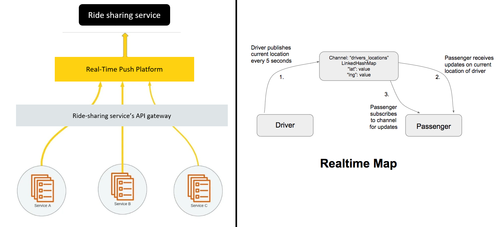

### 
Figure 3: Real-Time Ride Sharing Service system 

In addition to load balancing, Ride Sharing Service system also uses a number of other techniques to achieve scalability, including:

- Sharding: Ride Sharing Service system is sharded, which means that data is partitioned across multiple databases or servers. This allows the system to scale horizontally as new servers can be added to the cluster as needed.

- Caching: Ride Sharing Service system uses caching to reduce the load on its servers. By caching frequently accessed data, the system can avoid repeatedly retrieving the same data from the database, which can be a resource-intensive operation.

- Microservices: Ride Sharing Service system is based on a microservices architecture, which means that different parts of the system are broken down into smaller, independently deployable services. This makes it easier to scale individual components of the system as needed.

- Auto-scaling: Ride Sharing Service system uses auto-scaling to automatically add or remove servers based on the current level of traffic. This allows the system to maintain optimal performance even during periods of high traffic.

# <a id="system-context">[System Context](#system-context-1)</a>

The ride-sharing service operates within a larger system context, consisting of various external systems, interfaces, and communication protocols. The following diagram illustrates the system context of the ride-sharing service:

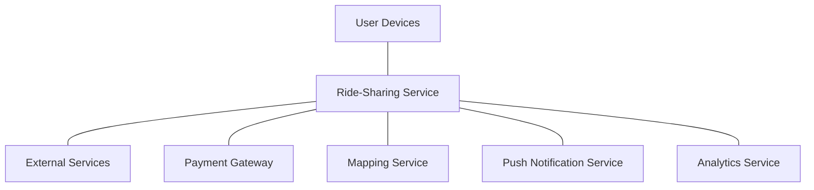

### 
Figure 4: System Context

As shown in the diagram, the ride-sharing service is connected to various external services, including user devices, a payment gateway, a mapping service, a push notification service, and an analytics service. The ride-sharing service communicates with these external services through various interfaces and protocols, such as HTTP, HTTPS, and REST.

User devices, such as mobile phones and tablets, are the primary interface for riders and drivers to interact with the ride-sharing service. They provide access to the ride-sharing app and enable users to request and accept rides, track ride status, and handle payments.

The payment gateway service processes payments made by riders and drivers, handling transactions securely and efficiently. The mapping service provides real-time location data and navigation services, allowing riders and drivers to optimize their routes and minimize travel time.

The push notification service sends real-time notifications to users about ride status updates, payment confirmations, and other relevant information. The analytics service collects and analyzes data on ride usage, user behavior, and service performance, providing insights to improve the quality and efficiency of the ride-sharing service.

The ride-sharing service is deployed on the internet and relies on various internet technologies, such as DNS, load balancers, firewalls, and security protocols, to ensure secure and reliable service delivery.

# <a id="architecture-components">[Architecture Components](#architecture-components-1)</a>

This Component diagram depicts the Car Sharing System, illustrating its components and the interfaces, ports, and relationships between them. It is a powerful tool used in Component-Based Development (CBD) to describe systems with Service-Oriented Architecture (SOA).

The Car Sharing System UML component diagram provides a comprehensive view of the organization and wiring of the physical components in the system. Its primary objective is to convey a clear and concise representation of the system's structure and its interrelationships.

The Car Sharing System is composed of several components, including the `Payment Component`, `Booking Component`, `Destination Component`, `Customer Component`, and `Insurance Component`. Each of these components plays a crucial role in the overall system, and they work together seamlessly to ensure that the Car Sharing System provides a reliable, efficient, and safe service to its users.

|           Component | Descripiton                                                                                                                                                                                                                                                    |
| ------------------: | :------------------------------------------------------------------------------------------------------------------------------------------------------------------------------------------------------------------------------------------------------------- |
|   Payment Component | The Payment Component is responsible for managing the payment transactions between the user and the system. It ensures secure and efficient processing of payment details and charges the user for each ride.                                                  |
|   Booking Component | The Booking Component handles the ride booking process, including ride requests, driver assignment, and fare calculation. It is responsible for ensuring that rides are assigned to the most suitable driver and that the user is charged an appropriate fare. |
|  Customer Component | Destination ComponentThe Destination Component is responsible for providing accurate and reliable destination information to the user. It tracks the location of drivers and users and provides distance and time estimates for rides.                         |
|  Customer Component | The Customer Component manages the user's account, including their profile, ride history, and preferences. It ensures that users have a smooth and seamless experience while using the Car Sharing System.                                                     |
| Insurance Component | The Insurance Component provides insurance coverage for the Car Sharing System. It ensures that users and drivers are protected in case of accidents or other incidents.                                                                                       |

The Car Sharing System Component diagram is a valuable tool for modeling and understanding the Car Sharing System's physical components, their relationships, and their interactions. It can help developers and system architects identify potential issues early in the design process and ensure that the system is designed to meet the needs of its users.
 
 

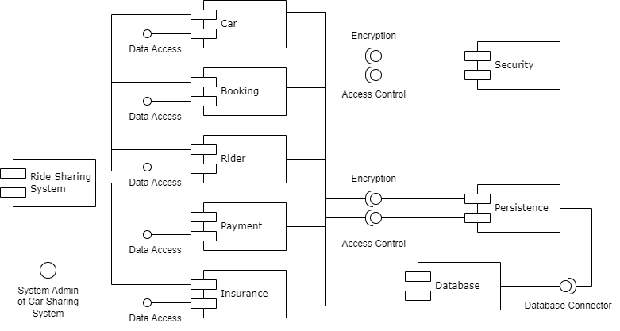

### 
Figure 5: Architecture Component Diagram

# <a id="functional-requirements">[Functional Requirements](#functional-requirements-1)</a>

## <a id="Essential-s">[Essential Requirements of Driver Interface](#Essential-s-1)</a>

| Rider/Passenger Interface | Requirements                                                                                                                                                                      |
| ------------------------: | :-------------------------------------------------------------------------------------------------------------------------------------------------------------------------------- |
|              Registration | Riders can `register` or sign in via `email` and `social media`. They can also register for different `payment methods`.                                                          |
|              Taxi Booking | The riders can book a taxi, enter their address, select the type of car, and adjust the pickup location.                                                                          |
|           Fare Calculator | The fare for traveling from point A to point B is automatically calculated based on the number of kilometers, the type of car chosen, current fuel rates, estimated traffic, etc. |
|             Ride Tracking | The driver’s location is tracked in Real-time based on which timely updates on traffic, travel routes, and the estimated time of arrival is provided to the rider.                |
|                   Payment | Cashless and in-app payment features are at the rider’s disposal. They can choose from various options, including credit cards, debit cards, net banking, PayPal, etc.            |
|       Messaging & Calling | Messages and calls to the rider providing the status of their ride.                                                                                                               |
|  Driver Rating & Analysis | Provide driver rating based on the journey, taken route, car comfort, driver’s behavior, etc.                                                                                     |
|            Travel History | The track record of the previous rides and transactions.                                                                                                                          |
|         Ride Cancellation | The rider has the option of canceling the ride, but needs to be done within a specified time limit to avoid paying the cancellation fee.                                          |
|             Split Payment | Riders also can opt to share a ride with other passengers.                                                                                                                        |
|        Schedule for Later | This feature allows the riders to book a ride in advance.                                                                                                                         |
|           Book for Others | Using this feature, one can also book a taxi for their friends, relatives, colleagues, etc.                                                                                       |

## <a id="essential-driver">[Essential Requirements of Driver Interface](#essential-driver-1)</a>

|   Driver Interface Requirements | Description                                                                                                                                                                                                       |
| ------------------------------: | :---------------------------------------------------------------------------------------------------------------------------------------------------------------------------------------------------------------- |
|         Driver Profile & Status | This feature gives the complete information of the driver, for example: if he/she is verified or not, their license, car insurance, etc. The driver’s availability status is also displayed through this feature. |
|                      Trip Alert | The driver would be notified for incoming ride requests, information on the destination, pickup location, travel route, and rider’s necessary details.                                                            |
|              Push Notifications | Notifications are received when the ride commences, any change in the travel route, heavy traffic ahead and on the completion of the ride                                                                         |
| Navigation & Route Optimization | The driver uses this feature to navigate the traffic, opt for the shortest way to the destination using the Google Maps                                                                                           |
|                         Reports | Provide insights regarding trips and earnings on a daily/weekly/monthly basis                                                                                                                                     |
|                    Waiting time | The rider would be charged extra if the waiting period exceeds 5minutes.                                                                                                                                          |
|                       Next Ride | The ride is notified of an upcoming ride while he/she is still completing the previous one.                                                                                                                       |

## <a id="essential-admin">[Essential Requirements of Admin Interface](#essential-admin-1)</a>

An Admin panel is crucial for the proper integration and smooth functioning of the system.
The basic features and functionalities of an Admin panel would be:

|                 Admin Interface Requirements | Description                                                                                                                                                                                                                                       |
| -------------------------------------------: | :------------------------------------------------------------------------------------------------------------------------------------------------------------------------------------------------------------------------------------------------ |
| Customer and Driver Details Management (CRM) | This feature enables the admin to manage and update the customer and driver details, including their personal information, contact information, and payment details. It helps the admin to keep track of their users and maintain their database. |
|                           Booking Management | Booking management feature is used to manage all the bookings made by customers. It allows the admin to view, update, and cancel the bookings. The admin can also assign drivers for the bookings and keep track of the booking status.           |
|    Vehicle Detail Management (if self-owned) | If the business owns its vehicles, the admin should be able to manage all the vehicle details, including registration details, insurance, and maintenance records.                                                                                |
|                Location and Fares Management | The admin panel should have a feature to manage the fare and location details. It allows the admin to update the fare prices and add new locations as required.                                                                                   |
|                       Call System Management | This feature enables the admin to manage the call system, including call recording and call logs. It helps the admin to track the customer support calls and provide better service.                                                              |
|                                Communication | Admin should be able to communicate with the customers and drivers using various channels such as email, SMS, and push notifications. It helps to keep the users informed about any updates or changes in the service.                            |
|                          Ratings and Reviews | The admin should be able to view and manage the ratings and reviews given by customers for the service. It helps to maintain the quality of the service and improve the customer satisfaction.                                                    |
|                     Promotions and Discounts | Admin should be able to create and manage the promotional offers and discounts for the users. It helps to attract new customers and retain the existing ones.                                                                                     |
|                           Payroll Management | If the business employs drivers or other staff, the admin should be able to manage their payroll details, including salary, incentives, and deductions.                                                                                           |
|                           Content Management | The admin should be able to manage the content on the website or app, including text, images, and videos. It helps to keep the content up-to-date and relevant.                                                                                   |
|                    Customer Support and Help | Admin should be able to provide customer support and help to the users. It helps to resolve any issues or queries raised by the users and improve the overall service quality.                                                                    |

# <a id="viewpoint">[Architecture Views](#viewpoint-1)</a>

## <a id="use-case-viewpoint">[Use Case Viewpoint](#use-case-viewpoint-1)</a>

Ride sharing services have become a popular mode of transportation for people all over the world. They offer an affordable and convenient way to get around, and can be accessed through a variety of platforms, including mobile apps and websites. In this Use Case Viewpoint, we will examine the different use cases for ride sharing services, including how they are used by passengers and drivers.

### Actors:

These actors play a crucial role in the ride sharing service use case. The primary users (Rider, Ride Sharing Company, and Driver) are responsible for the core functionality of the service, while the secondary users (GPS, Navigation Engine, and Payment Gateway) provide supporting functions to ensure that the ride is completed efficiently and securely.

### Primary users:

|         Primary user | Description                                                                  |
| -------------------: | :--------------------------------------------------------------------------- |
|                Rider | A person who needs a ride from one location to another.                      |
|               Driver | A person who provides a ride to a rider using their own vehicle.             |
| Ride Sharing Company | The organization that provides the ride sharing service and manages the API. |

### Secondary users:

|                 Secondary users | Description                                                                                                                                                                                                                                                                           |
| ------------------------------: | :------------------------------------------------------------------------------------------------------------------------------------------------------------------------------------------------------------------------------------------------------------------------------------ |
| GPS (Global Positioning System) | GPS is an actor that is responsible for providing real-time location data to the ride sharing service.                                                                                                                                                                                |
|               Navigation Engine | Navigation Engine is an actor that provides route guidance to the driver during the ride. The use case of Navigation Engine involves providing real-time traffic information, suggesting alternate routes, and providing turn-by-turn directions to the driver.                       |
|                 Payment Gateway | Payment Gateway is an actor that facilitates the transaction between the rider and the ride sharing service. The use case of Payment Gateway involves securely processing the payment information, verifying the transaction, and transferring the funds to the ride sharing service. |

### Use Cases:

This Use Case Diagram is a graphic depiction of the interactions among the elements of Car Sharing System. It represents the methodology used in system analysis to identify, clarify, and organize system requirements of Car Sharing System. The main actors of Car Sharing System in this Use Case Diagram are: Super Admin, System User, Customer, Driver, who perform the different type of use cases such as Manage Booking, Manage Customer, Manage Payment, Manage Car History, Manage Insurance, Manage Memebership, Manage Destination, Manage Users and Full Car Sharing System Operations.

Major elements of the UML use case diagram of Car Sharing System are shown on the picture below:

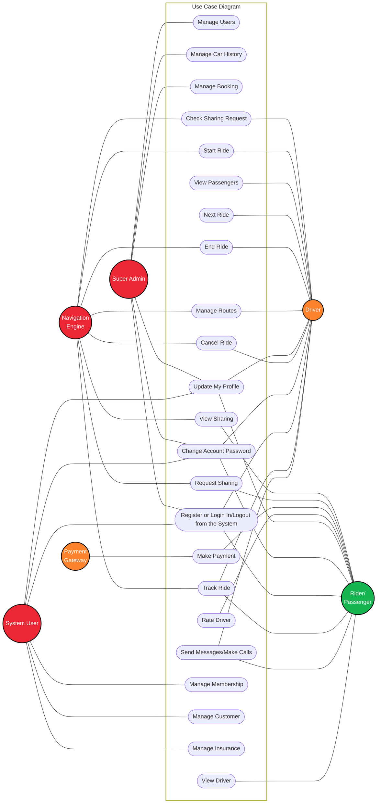

### 
Figure 6: Use Case Diagram

<!-- 

    
 Major elements of the UML use case diagram of  Car Sharing System are shown on the picture below: 

<!-- empty line -->
<!-- 

    

 -->
<!-- empty line -->

The Car Sharing System involves multiple actors and use cases, and the relationships among them are crucial for the system to function properly. Here are some possible relationships between the actors and use cases:

|            Actors | Description :                                                                                                                                                                                                                              |
| ----------------: | :----------------------------------------------------------------------------------------------------------------------------------------------------------------------------------------------------------------------------------------- |
|       Super Admin | The Super Admin is responsible for managing the entire system and has access to several functionalities, including managing users, car history, and bookings.                                                                              |
|       System User | System User refers to the user who manages the ride-sharing application's membership, customer, and insurance functionalities. They can update their profile, change their password, and perform registration and login/logout operations. |
|   Rider Passenger | The Rider/Passenger is a user who requests sharing and makes payments using the payment gateway. They can view available rides and drivers, rate drivers, cancel rides, and track their current rides.                                     |
|            Driver | The Driver is responsible for picking up riders, starting and ending rides, and managing routes. They can check sharing requests, view passengers, and proceed to the next ride.                                                           |
| Navigation Engine | Navigation Engine refers to the system's feature that allows riders to view their ride on a map and track their ride's progress.                                                                                                           |
|   Payment Gateway | The Payment Gateway is responsible for processing payments made by the riders.                                                                                                                                                             |

### The use cases of the Car Sharing System are:

| Use Cases                                                             | Description                                                                          |
| --------------------------------------------------------------------- | ------------------------------------------------------------------------------------ |
| Manage Users                                                          | The ability to create, modify, and delete user accounts in the system.               |
| Manage Car History                                                    | The ability to view the history of cars used in the system.                          |
| Manage Booking                                                        | The ability to book a ride for a rider passenger.                                    |
| View Sharing                                                          | The ability to view the shared ride options available to the rider passenger.        |
| Request Sharing                                                       | The ability to request a shared ride option from the system.                         |
| Make Payment                                                          | The ability to make a payment for the ride service.                                  |
| Rate Driver                                                           | The ability to rate the driver based on the ride experience.                         |
| Cancel Ride                                                           | The ability to cancel a ride that has been booked.                                   |
| View Driver                                                           | The ability to view the driver's details and information.                            |
| Register or Login In/Logout from the System                           | The ability to register as a new user or login/logout from the system.               |
| Update My Profile                                                     | The ability to update the user profile information.                                  |
| Change Account Password - The ability to change the account password. |
| Track Ride                                                            | The ability to track the ride in real-time.                                          |
| Send Messages/Make Calls                                              | The ability to communicate with the driver or rider passenger via messages or calls. |
| Check Sharing Request                                                 | The ability to check the status of a shared ride request.                            |
| Start Ride                                                            | The ability to start the ride once the rider passenger and driver are ready.         |
| View Passengers                                                       | The ability to view the other passengers in a shared ride.                           |
| Next Ride                                                             | The ability to book the next ride in advance.                                        |
| End Ride                                                              | The ability to end the ride once the destination is reached.                         |
| Manage Routes                                                         | The ability to manage the routes and destinations in the system.                     |
| Manage Membership                                                     | The ability to manage the membership plans and options for the rider passenger.      |
| Manage Customer                                                       | The ability to manage the customer information and details.                          |
| Manage Insurance                                                      | The ability to manage the insurance information and details for the ride service.    |

## <a id="logical-viewpoint">[Logical Viewpoint](#logical-viewpoint-1)</a>

A logical view of a ride-sharing service can be represented as a layered architecture. Layer Design is a common approach used to design complex systems, which involves breaking down the system into several layers, with each layer responsible for a specific set of functionalities. As domains move from lower to higher layers, they impact fewer services in the case of an outage and represent more specific product use cases. This approach ensures that the system is modular, scalable, and easy to maintain.

|    Logical Viewpoint | Description                                                                                                                                                                                                                                                                                                                              |
| -------------------: | :--------------------------------------------------------------------------------------------------------------------------------------------------------------------------------------------------------------------------------------------------------------------------------------------------------------------------------------- |
|           Edge layer | The Edge Layer is the gateway that safely exposes user functionality to the outside world, including mobile apps and other clients. This layer provides a secure boundary between the outside world and the rest of the system, protecting it from potential security threats.                                                           |
|   Presentation Layer | The Presentation Layer serves client-specific use cases in ride-sharing service client apps. It provides an interface between the client and the rest of the system, enabling communication between the two. This layer uses API technology options such as Resource Oriented APIs, WebSockets, GraphQL, and gRPC.                       |
|        Product Layer | The Product Layer houses services and functionalities that enable line-of-business-specific use cases, such as Mobility, Delivery, and Freight. These functionalities are designed to meet the specific requirements of each line of business and provide value-added services to users.                                                 |
|       Business Layer | The Business Layer provides common, core functionality that ride-sharing services can use for any product or use case. These functionalities are generic and are not specifically designed for a particular line of business. Examples of functionalities in this layer include user authentication, authorization, and data validation. |
| Infrastructure Layer | The Infrastructure Layer provides shared platform infrastructure components, like networking, streaming, storage, machine learning, and AI infrastructure. This layer provides the underlying infrastructure necessary to support the system's functionalities and ensure its scalability and reliability.                               |

<be>

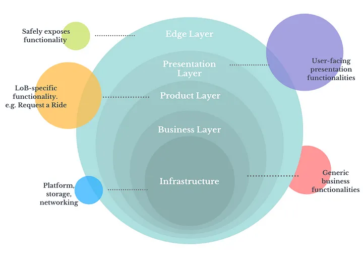

Figure 7: Layer Design

In conclusion, a layer design approach enables the ride-sharing system to be modular, scalable, and easy to maintain. Each layer is independent of the other layers, communicates through well-defined interfaces, and provides specific functionalities that cater to the system's needs. This design approach ensures that the ride-sharing system can meet the requirements of different lines of business and provide value-added services to users.

## <a id="process-viewpint">[Process Viewpint](#process-viewpint-1)</a>

This diagram shows the lifelines of a taxi booking system and the interactions between them. It shows the process of ordering a taxi ride. A rider can choose a pick-up point, destination, and time of pick up.

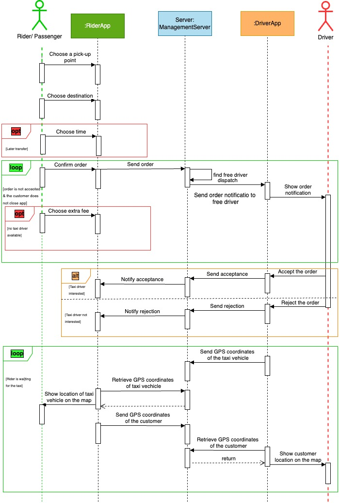

Figure 8: Process Diagram for Taxi Booking System

 
The diagram shows these lifelines:

- Rider
- Rider App
- Management Server
- Driver App
- Driver

There are these interactions between the lifelines:

- Choose a pick-up point
- Choose destination
- (Optional) Later transfer
- Choose time
- (Loop) Order is not accepted and the customer does not close app
  - Confirm order
  - Send order
  - Find free drivers
  - Send order notification to free drivers
  - Show order notification
  - (Optional) No taxi driver available
    - Choose extra fee
- (Alternative 1) Taxi driver interested
  - Accept the order
  - Send acceptance
  - Notify acceptance
- (Alternative 2)Taxi driver not interested
  - Reject the order
  - Send rejection
  - Notify rejection
- (Loop) Rider is waiting for the taxi
  - Send GPS coordinates of the taxi vehicle
  - Retrieve GPS coordinates of taxi vehicle
  - Show location of taxi vehicle on the map
  - Send GPS coordinates of the customer
  - Retrieve GPS coordinates of the customer
  - Show customer location on the map

### Process diagram of Sing up or Login

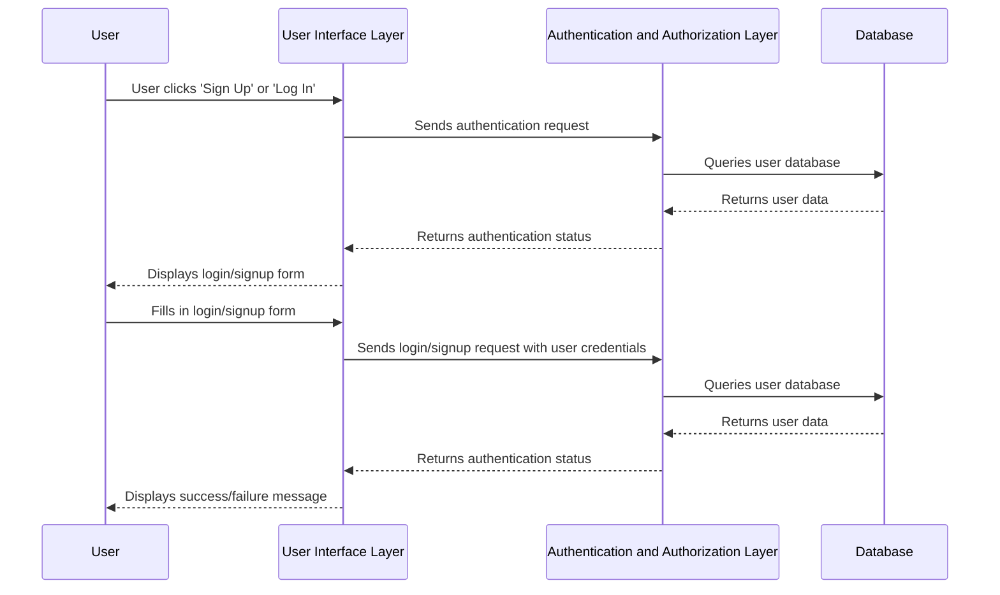

 
 

 Figure 9:  Process diagram of Sing up or Login 

## <a id="context-viewpoint">[Context Viewpoint](#context-viewpoint-1)</a>

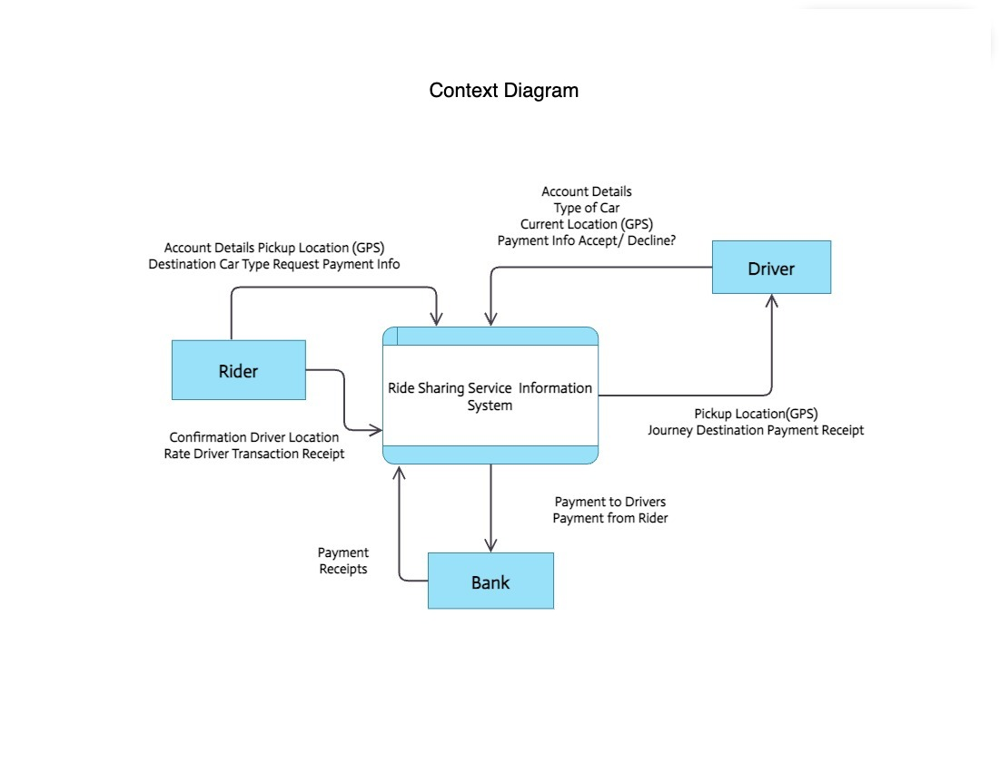

Figure 10: Context Diagram

# <a id="deployment">[Deployment Viewpoint](#deployment-1)</a>

Deployment refers to the process of taking software code and making it available to end-users. For a ride sharing service, deployment is critical to ensuring that riders and drivers can use the service seamlessly. A typical ride sharing service will have several components, such as the mobile app, the back-end server, and the database.

The deployment process for a ride sharing service involves the following steps:

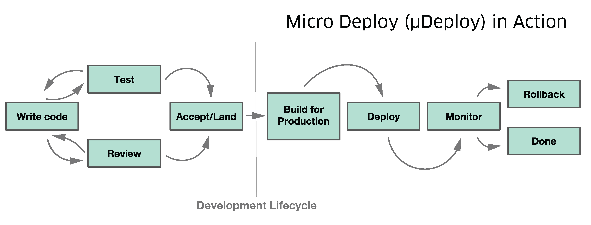

Figure 11: Development Lifecycle

Code review: Before deploying any code changes, the development team should review the code to ensure it meets the project requirements and is free from bugs and security vulnerabilities.

Build: The code is then built into an executable package that can be deployed. This may involve compiling the code, packaging it into a container, or using a build tool like Maven.

Testing: The deployment package is tested to ensure it works as expected. This includes unit tests, integration tests, and end-to-end testing.

Deployment: Once the code is tested and approved, it can be deployed to the production environment. This may involve using a continuous deployment tool like Jenkins or GitLab CI/CD.

Monitoring: After deployment, the service should be monitored for issues and performance metrics. This includes monitoring the server health, database performance, and user feedback.

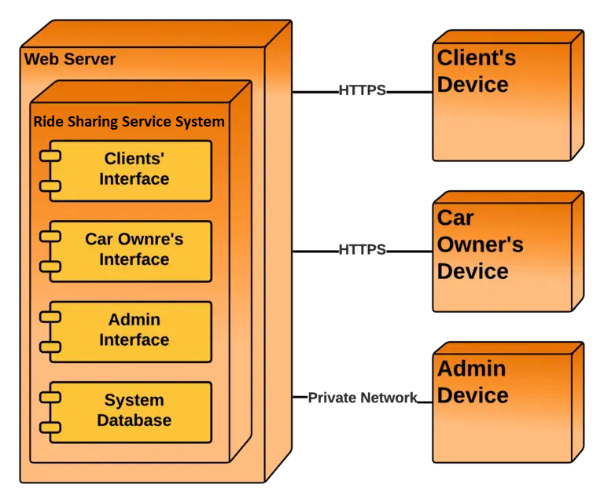

Figure 12: UML Deployment Diagram for Car Ride Sharing Service System

From a ride sharing service's point of view, deployment is critical to ensure that the service is available to riders and drivers at all times. Any downtime or issues with the service can result in lost revenue and a poor user experience. Therefore, it is essential to have a robust deployment process that includes testing and monitoring to ensure the service is reliable and performant.

# <a id="database-devel">[Database Development](#database-devel-1)</a>

 

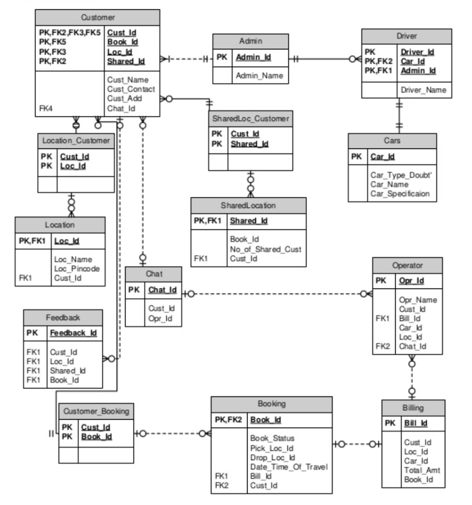

 

Figure 13: Database Schama

# <a id="architecture-patterns">[Architecture Patterns](#architecture-patterns-1)</a>

These patterns are designed to improve the scalability, reliability, and performance of the ride sharing service.

|                Architecture Pattern | Explanation                                                                                                                                                                               | Ride-Sharing Service Application                                                                                                                                                                                                                                                                                                   |
| ----------------------------------: | :---------------------------------------------------------------------------------------------------------------------------------------------------------------------------------------- | :--------------------------------------------------------------------------------------------------------------------------------------------------------------------------------------------------------------------------------------------------------------------------------------------------------------------------------- |
|                       Microservices | The use of independently deployable services, each with its own functionality, data storage, and API, to build a larger application                                                       | In a ride-sharing service, different microservices could handle different functions, such as user authentication, ride matching, payment processing, and driver dispatching, allowing for more flexibility and scalability                                                                                                         |
| Service-Oriented Architecture (SOA) | A design approach that structures an application as a collection of services, which communicate with each other through APIs, and are loosely coupled and independent                     | In a ride-sharing service, SOA could allow for greater modularity and easier integration of new features, such as carpooling, different payment options, or integration with public transit                                                                                                                                        |
|     Event-Driven Architecture (EDA) | A design approach that emphasizes the production, detection, consumption, and reaction to events, using asynchronous communication and decoupled systems                                  | In a ride-sharing service, EDA could be used to handle real-time events, such as ride requests, driver availability, or traffic conditions, and trigger appropriate actions or notifications                                                                                                                                       |
|                    Containerization | The use of lightweight, portable, and isolated runtime environments, known as containers, to package and deploy applications and their dependencies                                       | In a ride-sharing service, containerization could allow for easier deployment and scaling of microservices, as well as more efficient use of resources                                                                                                                                                                             |
|                         RESTful API | A design style for building web services, based on HTTP and CRUD operations, that allows for stateless and scalable communication between clients and servers                             | In a ride-sharing service, RESTful APIs could provide standardized communication between different components, such as mobile apps, web dashboards, or third-party integrations, allowing for greater interoperability and flexibility                                                                                             |
|                     Cloud Computing | The use of remote servers and resources, accessed through the internet, to store, process, and manage data and applications, instead of local hardware                                    | In a ride-sharing service, cloud computing could provide greater scalability, availability, and cost-effectiveness, as well as easier access to advanced services, such as machine learning, analytics, or geolocation                                                                                                             |
|                       Data Sharding | The technique of partitioning data horizontally, based on a key or attribute, and distributing it across multiple servers or nodes, to improve performance, scalability, and availability | In a ride-sharing service, data sharding could be used to handle large volumes of data, such as user profiles, ride histories, or traffic patterns, and reduce the risk of downtime or data loss                                                                                                                                   |
|                      Load Balancing | The process of distributing incoming network traffic across multiple servers or nodes, to optimize resource utilization, improve performance, and ensure high availability                | In a ride-sharing service, load balancing could be used to handle variable traffic volumes, prevent overloading of specific components, such as databases or APIs, and maintain a consistent user experience                                                                                                                       |
|                                CQRS | Separating the read and write sides of an application, allowing for different data models and optimization strategies.                                                                    | This pattern is useful when we have different needs for reading and writing data, such as when we need to handle large amounts of data or complex queries. For example, we might use CQRS to optimize reading data for driver matching, while writing data for handling payments.                                                  |
|                          Serverless | Using cloud functions or services to handle specific tasks, without managing servers or infrastructure.                                                                                   | This pattern is useful when we need to handle spikes in traffic or unpredictable usage, and when we want to focus on application functionality rather than infrastructure management. For example, we might use serverless functions to handle user authentication or image processing.                                            |
|                        Service Mesh | Managing communication between microservices, including traffic routing, load balancing, and security.                                                                                    | This pattern is useful when we have many microservices that need to communicate with each other, and when we want to handle service discovery and routing in a centralized way. For example, we might use a service mesh to handle communication between the user interface, the driver matching service, and the payment service. |

These are just a few of the architecture patterns that could be used in a ride-sharing service application, and there are many other factors to consider, such as security, reliability, maintainability, and user experience. It's important to choose the right patterns for the specific use case and requirements, and to constantly evaluate and evolve the architecture as the application grows and changes over time.

## Microservices Pattern

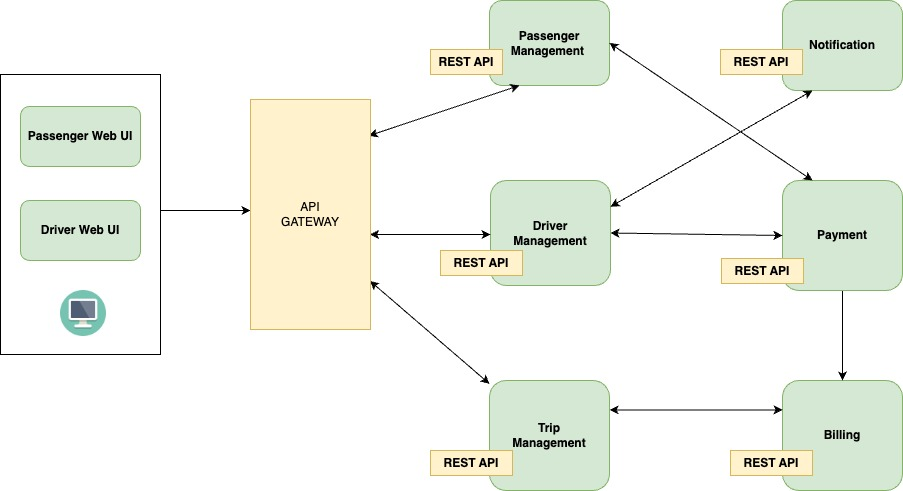

Figure 14: Microservice Architecture Of Ride Sharing Service

API Gateway Since clients don’t call the services directly, API Gateway acts as an entry point for the clients to forward requests to appropriate microservices.

The major change that we observe here is the introduction of API Gateway through which all the drivers and passengers are connected. From the API Gateway, all the internal points are connected such as passenger management, driver management, trip management and others.
The units are individual separate deployable units performing separate functionalities.

For Example: If you want to change anything in the billing Microservices, then you just have to deploy only billing Microservices and don’t have to deploy the others.

All the features were now scaled individually i.e. The interdependency between each and every feature was removed.
For Example, we all know that the number of people searching for cabs is more comparatively more than the people actually booking a cab and making payments. This gets us an inference that the number of processes working on the passenger management microservice is more than the number of processes working on payments.

# <a id="data-managment">[Architecture Decisions ](#data-managment-1)</a>

Here are some sample architecture decisions for the Ride Sharing Service, along with their explanations and justifications from the perspective of a ride sharing service:

| Architecture Decision                              | Explanation                                                                                                                                                                                                                                                                                                                                                | Justification                                                                                                                                                                                                                                                                                                                              |
| -------------------------------------------------- | ---------------------------------------------------------------------------------------------------------------------------------------------------------------------------------------------------------------------------------------------------------------------------------------------------------------------------------------------------------- | ------------------------------------------------------------------------------------------------------------------------------------------------------------------------------------------------------------------------------------------------------------------------------------------------------------------------------------------ |
| Microservices Architecture                         | The Ride Sharing Service is designed as a collection of loosely coupled microservices, each responsible for a specific aspect of the application (e.g. user management, ride requests, ride matching, payment processing, etc.). This architecture allows for greater scalability, fault tolerance, and flexibility compared to a monolithic architecture. | By breaking down the application into smaller, independent components, we can scale each component independently based on its demand. Also, if one microservice fails, it won't bring down the entire application.                                                                                                                         |
| Kubernetes Orchestration                           | The microservices are deployed on a Kubernetes cluster, which provides automated scaling, self-healing, and load balancing.                                                                                                                                                                                                                                | Kubernetes simplifies deployment and management of microservices, and provides built-in mechanisms for scaling up or down based on demand. Additionally, Kubernetes can automatically recover from failures, reducing the need for manual intervention.                                                                                    |
| REST API for Communication                         | The microservices communicate with each other via REST APIs, which allows for a standardized, platform-agnostic way of exchanging data.                                                                                                                                                                                                                    | REST APIs provide a simple and easy-to-use interface for inter-service communication, and allow for easy integration with other services or third-party tools.                                                                                                                                                                             |
| Event-Driven Architecture for Real-Time Processing | Events are used to notify other services of changes in the system (e.g. a new ride request, a ride has been matched, a payment has been processed, etc.). This allows for real-time processing and reduces the need for polling or frequent API calls.                                                                                                     | Event-driven architecture allows us to respond to changes in the system in real-time, which is especially important for ride sharing services, where timely processing is critical. By using events, we can reduce the amount of polling or API calls required, which can improve performance and reduce costs.                            |
| MongoDB for Data Storage                           | The application uses MongoDB as the primary database, which provides a scalable, flexible, and highly available solution for storing and retrieving data.                                                                                                                                                                                                  | MongoDB is a popular choice for NoSQL databases due to its flexible schema, horizontal scaling, and automatic failover capabilities. These features are well-suited for the dynamic and rapidly changing data requirements of a ride sharing service.                                                                                      |
| Redis for Caching                                  | Redis is used as an in-memory cache for frequently accessed data, such as user profiles and ride requests. This helps to reduce the load on the database and improve performance.                                                                                                                                                                          | Redis is a popular choice for caching due to its fast read and write speeds, support for multiple data types, and built-in features for managing data expiration and eviction. By caching frequently accessed data in Redis, we can reduce the number of database queries required and improve the overall performance of the application. |

These are just a few examples of architecture decisions that might be made for a ride sharing service. Other decisions might include the use of specific programming languages or frameworks, the adoption of specific security or monitoring tools, or the integration with other third-party services or APIs. Ultimately, the architecture of a ride sharing service should be designed to meet the specific needs and requirements of the business, while also providing a scalable, flexible, and resilient foundation for growth and innovation.

## Architecture Decision for Microservice Pattern

These were the main Challenges faced by the monolithic software framework that Ride Sharing Service worked with.

- To update even a single feature, every feature had to be built again, deployed and tested many times.
- To update even a single feature, every feature had to be built again, deployed and tested many times.
  Fixing bugs became a very difficult job as there was only a single codebase, and developers had to change the code in this repository again and again.
- Scaling any feature together with the introduction of new features over many countries is getting to be very tough.

The introduction of the API gateway connected passengers and drivers. Similarly, from the gateway, other internal points, such as passenger/driver/trip management, and other internal points are connected.

All the units are designed to perform their functions independently.

Every feature could be scaled independently of the other. As an example, the number of people searching for taxis is greater than the number of people that actually book the taxi services and make the payments. This also means that the number of processes that handle passenger management is greater than the number that manages the payment processes.

Ride Sharing Service broke down its monolith into cloud-based microservices for each of the functionalities and connected these via an API gateway.

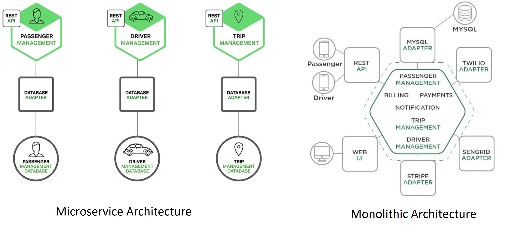

Figure 15: Architecture Decision for Microservice Pattern

### Ride Sharing Service Microservices Architecture – Benefits

- Individual development teams were assigned ownership of specific services which helped to boost the quality, speed, and manageability of new module development.
- Teams were allowed to focus only on the services that needed scaling, and this helped to scale at high speed.
- Individual services could be updated without disrupting any other services.
- Fault tolerance has become more reliable.

# <a id="conclusion">[Conclusion](#conclusion-1)</a>

The ride-sharing service industry has revolutionized the way people travel, and its popularity continues to grow worldwide. In conclusion, ride-sharing services offer numerous benefits, including convenience, affordability, and reduced environmental impact.

These services have also provided new income opportunities for drivers, allowing them to work flexible hours and earn additional income. However, there are also potential drawbacks, such as concerns over safety and security, and the impact on traditional taxi and public transportation services.

Overall, the future of ride-sharing services looks promising, with continued innovation and improvements in technology expected to further enhance the user experience and address any remaining concerns.

# <a id="references-s">[References](#references-s-1)</a>

1. Zheng, Y., Li, Q., Chen, Y., Xie, X., & Ma, W. (2018). A survey of ride sharing. Transportation Research Part C: Emerging Technologies, 96, 380-393.
1. Wang, X., Guo, Y., Huang, M., & Yu, B. (2019). A novel group decision-making method based on multi-attribute decision-making for ride-sharing. IEEE Access, 7, 45899-45907.
1. Sun, X., Zhang, W., & Wang, Y. (2018). Ride sharing in autonomous vehicle era: A survey. IEEE Transactions on Intelligent Transportation Systems, 19(12), 3808-3823.
1. D. D. S. Gopala Rao, S. Bhowmick, K. Desai and M. Shukla, "A Systematic Survey of Real-Time Ridesharing: From User Behaviour to Future Directions," in IEEE Transactions on Intelligent Transportation Systems, vol. 22, no. 7, pp. 4019-4042, July 2021.
1. Zhang, H., Wu, J., Liu, Y., Gu, X., & Xu, M. (2019). A spatiotemporal-sentiment-aware method for taxi ride-sharing. IEEE Transactions on Intelligent Transportation Systems, 20(10), 3827-3840.
