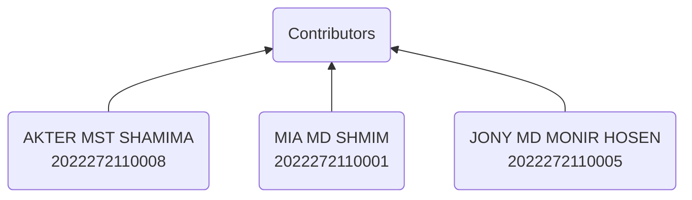

 
 

<h1 align="center" >

<b>Ride Sharing Service</b>

</h1>
 
Get dynamically generated GitHub stats!

  
  
  
  
   

---
## Table of Contents

1. [Introduction](#introduction)
1. [Business Requirements](#business-requirements)
1. [Stakeholder Analysis](#stakeholder-analysis)
1. [Architecture Principles](#architecture-principles)
1. [Architecture Components](#architecture-components)
1. [Functional Requirements](#functional-requirements)
1. [Viewpoint](#viewpoint)
   - [Use Case Viewpoint](#use-case-viewpoint)
   - [Logical Viewpoint](#logical-viewpoint)
   - [Functional Viewpoint](#functional-viewpoint)
   - [Development Viewpoint](#development-viewpoint)
   - [Deployment View](#deployment-view)
   - [Context Viewpoint](#context-viewpoint)
1. [Quality Attribute](#quality-attribute)
   - [Consistency](#consistency)
   - [Availability](#availability)
   - [Scalability](#scalability)
   - [Flexibility](#flexibility)
   - [Security](#security)
   - [Performance](#performance)
1. [Technical Debt](#technical-debt)
1. [Conclusion](#conclusion)
1. [References](#references)
1. [Appendix](#appendix)

# Introduction

The ride-sharing industry has exploded in popularity in recent years, with services such as `Uber`, `Lyft`, and `Grab` becoming ubiquitous in cities around the world. These services offer a new and convenient way for people to get around, using a combination of technology and transportation to connect riders with drivers. However, designing and implementing a successful ride-sharing service is no simple feat, and requires careful consideration of a wide range of `technical`, `logistical`, and `social` factors.

This software architecture document aims to provide a detailed overview of the architecture of a `ride-sharing service`, including the key components and systems involved in its operation. This document is intended for `developers`, `architects`, and `stakeholders` who are involved in the `development` or `management` of a ride-sharing service, and who need to understand the technical aspects of the service in order to make informed decisions.

The document will begin by providing an overview of the `ride-sharing industry`, including the key players and trends that have emerged in recent years. This will be followed by a detailed description of the architecture of a `typical ride-sharing service`, including the key components such as the `rider app`, `driver app`, and `backend systems`. The document will also cover topics such as `data privacy` and `security`, `scalability` and `performance`, and `integration` with `third-party` services.

Overall, this document aims to provide a comprehensive and practical guide to the architecture of a ride-sharing service, with a focus on the technical considerations and challenges involved in designing and operating such a service. By providing a clear and detailed understanding of the key systems and components involved in a ride-sharing service, this document will help developers and `stakeholders` to make informed decisions and build successful ride-sharing services that meet the needs of `riders`, `drivers`, and `other stakeholders`.

# Business Requirements

Before we dive deeper into the architecture of the ride-sharing service, let's first define the business requirements. The ride-sharing service should meet the following requirements:

|Requirements | Descriptions|
|---: | :---|
|Passenger and Driver Registration | The service should allow passengers and drivers to easily `register` and `create` accounts.|
|Ride Requests | Passengers should be able to `request rides` using the `app`, specifying their `pickup` and `dropoff locations`, and the `type of vehicle` they want. Drivers should receive notifications of `incoming ride requests`.|
|Driver Acceptance | Drivers should be able to `accept` or `reject` ride requests based on their availability.|
|Navigation | The app should provide `navigation` instructions to the pickup and dropoff locations for both passengers and drivers.|
|Real-Time Tracking | Passengers should be able to track the driver's location in `real-time`.
|Payment Processing | The service should process payments `securely` and `efficiently`, handling `refunds`, `chargebacks`, and `disputes`.
|Ratings and Reviews | Passengers and drivers should be able to `rate` each other and leave `reviews`.
|Customer Support | The service should provide `customer support` to handle `issues` and `complaints`.
| Reducing costs | Companies aim to optimize their operations to `reduce costs`, including driver `acquisition` and `retention`, `maintenance of vehicles`, and `marketing expenses`.|

Now that we have defined the business requirements, let's move on to the `architecture of the ride-sharing` service.

# Stakeholder Analysis
In the case of a ride-sharing service, `stakeholders` can include a wide range of individuals or groups who have an `interest` or `investment` in the success of the service. Some examples of stakeholders in a ride-sharing service might include:

|Stackeholder | Analysis|
|---: | :---|
|Investors | Investors who have put `money` into the ride-sharing service and expect a return on their `investment`. These investors may include `venture capitalists`, `angel investors`, or `institutional investors`.|
|Riders | People who use the ride-sharing service to get from one place to another. These individuals have a stake in the success of the service because they `rely` on it for `transportation`.|
|Drivers | Individuals who work for the ride-sharing service and `provide rides` to `riders`. Drivers have a stake in the success of the service because their `livelihood` depends on it.|
|Administrators | People who are responsible for managing the ride-sharing service, including making `decisions about pricing`, `marketing`, and `customer support`.|
|Regulators | `Government agencies` or other entities that have `regulatory authority` over the ride-sharing service. These regulators may have an interest in ensuring that the service operates in compliance with `local laws` and `regulations`.|
|Competitors | Other companies that offer ride-sharing services and may be `impacted` by the success of the service.|

Each stakeholder group may have different goals, interests, and `expectations` for the ride-sharing service, and it's important to consider their perspectives when designing the architecture of the service. By understanding the needs and goals of each stakeholder group, architects can design a ride-sharing service that meets the needs of everyone involved and is `well-positioned` for success.

In addition to the stakeholders who have a `positive interest` or investment in the success of the ride-sharing service, there may also be **`negative stakeholders`** who have concerns or objections to the service. Some examples of negative stakeholders in a ride-sharing service might include:

|Negative Stakeholders | Analysis|
|---: | :---|
|Taxi companies | Traditional taxi companies may see ride-sharing services as competition and may have negative opinions about the service. They may `lobby` against the service or try to `block` its entry into certain `markets`.|
|Local governments | Some local governments may have concerns about the impact of ride-sharing services on `traffic congestion`, `public safety`, and `revenue` from traditional taxi and transportation fees. They may `impose regulations` or taxes on the service that `increase costs` or `limit` its operations.|
|Labor unions | Labor unions may have concerns about the working conditions and wages of ride-sharing service drivers. They may lobby for `greater protections` or regulations that `limit the flexibility` or earning `potential` of drivers.|
|Environmental groups | `Environmental groups` may be concerned about the impact of ride-sharing services on `air quality` and `carbon emissions`. They may advocate for `alternative transportation` solutions or `policies` that limit the use of ride-sharing services.|
|Privacy advocates | `Privacy advocates` may have concerns about the collection and use of user data by ride-sharing services. They may `advocate for greater privacy protections` or `transparency around` how user data is collected and used.|

Understanding the concerns and `objections of negative stakeholders` is important in designing a ride-sharing service that is `sustainable` and `responsive` to the needs of all stakeholders. By considering the perspectives of both positive and negative stakeholders, architects can design a ride-sharing service that addresses concerns and objections while still meeting the needs of `riders`, `drivers`, `investors`, and other `positive stakeholders`.

# Architecture Principles
The architecture principles for a ride-sharing service may vary depending on the specific needs and goals of the service. However, here are some `potential` architecture principles:

|Architecture Principles | Descriptions|
|---: | :---|
|Geolocation | The architecture should support the ability to `locate` and `track` drivers and passengers in `real-time` using `GPS` and `geolocation` data.|
|Scalability | The architecture should be designed to handle `large volumes of requests` and `traffic during peak times`, such as `rush hour` or `major events`.|
|Dynamic pricing | The architecture should support the ability to adjust pricing in real-time based on `supply` and `demand`, such as `surge pricing during peak times`.|
|Ratings and reviews | The architecture should include mechanisms for riders and drivers to `rate` and `review` each other, which can help `maintain` a high level of service `quality` and `safety`.|
|Payment processing | The architecture should support `secure` and `reliable payment processing` for riders and drivers, including options for `different payment methods` and `currencies`.|
|Matching algorithms | The architecture should include `intelligent matching algorithms to match riders with drivers based on factors such as proximity`, `availability`, and `ride history`.|
|Driver verification | The architecture should include mechanisms for `verifying` the `identity` and `qualifications` of drivers, including `background checks`, `driver’s license verification`, and `vehicle inspections`.|
|Customer support | The architecture should include `robust customer support mechanisms`, including `chatbots`, `phone support`, and `email support`, to address any issues or concerns that riders or drivers may have.|
|Regulatory compliance | The architecture should comply with local `regulations` and laws related to ride-sharing services, such as `licensing requirements` and `insurance regulations`.|
|Continuous improvement | The architecture should support the ability to continuously `improve` the service through `data analytics`, `user feedback`, and `testing of new features` and `services`.|

# Architecture Components

The architecture components of a ride-sharing service can be broken down into `several layers`, each with their own set of components. Here are some `potential architecture components` for a ride-sharing service:

|Architecture Components | Descriptions|
|---: | :---|
|Presentation Layer | This layer includes the components that `interact` with users, such as `mobile apps` or `web interfaces`, and allows riders and drivers to `request` or `accept` rides, `track` the location of their ride, and `communicate` with each other.|
|Application Layer | This layer includes the `logic` that manages the ride-sharing service, such as `matching algorithms` that `connect` drivers with riders, `pricing algorithms` that determine ride `costs`, and `payment processing` components that `handle payments`.|
|Service Layer | This layer includes the components that provide `backend services`, such as `geolocation` services that track the location of drivers and passengers, and `notification` services that `alert` drivers and riders of ride `requests` or `updates`.|
|Data Layer | This layer includes the components that `store` and manage `data` related to the ride-sharing service, such as `user profiles`, `ride history`, `payment information`, and `driver qualifications`.|
|Infrastructure Layer | This layer includes the `hardware` and `software` infrastructure that supports the ride-sharing service, such as `servers`, `databases`, and `network components`.|
|Analytics Layer | This layer includes the components that provide `data analytics` and `business intelligence`, such as tools for `monitoring service` performance, `analyzing rider` and `driver behavior`, and `identifying areas` for improvement.|
|Security Layer | This layer includes the components that ensure the security of the ride-sharing service, such as `authentication` and `access control mechanisms`, `data encryption`, and `monitoring` for `suspicious activity`.|
|Integration Layer | This layer includes the components that integrate the ride-sharing service with other `systems` or `services`, such as `third-party payment processors`, `mapping` services, or `social media` platforms.|

Overall, the architecture of a ride-sharing service should be designed to provide a `reliable`, `scalable`, and secure platform that can deliver high-quality services to riders and drivers while complying with `regulatory requirements` and `evolving` to meet changing market needs.
# Functional Requirements

## Essential Requirements of Rider/Passenger Interface

- Registration: Riders can register or sign in via email and social media. They can also register for different payment methods.
- Riders can request a ride
- Taxi Booking: The riders can book a taxi, enter their address, select the type of car, and adjust the pickup location. 
- Fare Calculator: The fare for traveling from point A to point B is automatically calculated based on the number of kilometers, the type of car chosen, current fuel rates, estimated traffic, etc
- Ride Tracking: The driver’s location is tracked in Real-time based on which timely updates on traffic, travel routes, and the estimated time of arrival is provided to the rider.
- Payment: Cashless and in-app payment features are at the rider’s disposal. They can choose from various options, including credit cards, debit cards, net banking, PayPal, etc. 
- Messaging & Calling: Messages and calls to the rider providing the status of their ride.
- Driver Rating & Analysis: Provide driver rating based on the journey, taken route, car comfort, driver’s behavior, etc.
- Travel History: The track record of the previous rides and transactions.
- Ride Cancellation: The rider has the option of canceling the ride, but needs to be done within a specified time limit to avoid paying the  cancellation fee.
- Split Payment: Riders also can opt to share a ride with other passengers. 
- Schedule for Later: This feature allows the riders to book a ride in advance. 
- Book for Others: Using this feature, one can also book a taxi for their friends, relatives, colleagues, etc.

## Essential Requirements of Driver Interface

- Driver Profile & Status: This feature gives the complete information of the driver, for example: if he/she is verified or not, their license, car insurance, etc. The driver’s availability status is also displayed through this feature.
- Trip Alert: The driver would be notified for incoming ride requests, information on the destination, pickup location, travel route, and rider’s necessary details.
- Push Notifications: Notifications are received when the ride commences, any change in the travel route, heavy traffic ahead and on the completion of the ride
- Navigation & Route Optimization: The driver uses this feature to navigate the traffic, opt for the shortest way to the destination using the Google Maps
- Reports: Provide insights regarding trips and earnings on a daily/weekly/monthly basis
- Waiting time: The rider would be charged extra if the waiting period exceeds 5minutes.
- Next Ride: The ride is notified of an upcoming ride while he/she is still completing the previous one.

## Essential Requirements of Admin Interface
An Admin panel is crucial for the proper integration and smooth functioning of the system.
The basic features and functionalities of an Admin panel would be:
- Customer and Driver Details Management (CRM)
- Booking Management
- Vehicle Detail Management (if self-owned)
- Location and Fares Management
- Call System Management
- Communication
- Ratings and Reviews
- Promotions and Discounts
- Payroll Management
- Content Management
- Customer Support and Help

# Viewpoints

## Use Case Viewpoint

Ride sharing services have become a popular mode of transportation for people all over the world. They offer an affordable and convenient way to get around, and can be accessed through a variety of platforms, including mobile apps and websites. In this Use Case Viewpoint, we will examine the different use cases for ride sharing services, including how they are used by passengers and drivers.

### Actors:

These actors play a crucial role in the ride sharing service use case. The primary users (Rider, Ride Sharing Company, and Driver) are responsible for the core functionality of the service, while the secondary users (GPS, Navigation Engine, and Payment Gateway) provide supporting functions to ensure that the ride is completed efficiently and securely.

### Primary users:

1. Rider: A person who needs a ride from one location to another.
1. Driver: A person who provides a ride to a rider using their own vehicle.
1. Ride Sharing Company: The organization that provides the ride sharing service and manages the API.

### Secondary users:
1. GPS (Global Positioning System): GPS is an actor that is responsible for providing real-time location data to the ride sharing service.
1. Navigation Engine: Navigation Engine is an actor that provides route guidance to the driver during the ride. The use case of Navigation Engine involves providing real-time traffic information, suggesting alternate routes, and providing turn-by-turn directions to the driver.
1. Payment Gateway: Payment Gateway is an actor that facilitates the transaction between the rider and the ride sharing service. The use case of Payment Gateway involves securely processing the payment information, verifying the transaction, and transferring the funds to the ride sharing service.

### Use Cases:
This Use Case Diagram is a graphic depiction of the interactions among the elements of  Car Sharing System. It represents the methodology used in system analysis to identify, clarify, and organize system requirements of  Car Sharing System. The main actors of  Car Sharing System in this Use Case Diagram are: Super Admin, System User, Customer, Driver, who perform the different type of use cases such as Manage Booking, Manage Customer, Manage Payment, Manage Car History, Manage Insurance, Manage Memebership, Manage Destination, Manage Users and Full  Car Sharing System Operations. Major elements of the UML use case diagram of  Car Sharing System are shown on the picture below.

The relationships between and among the actors and the use cases of  Car Sharing System: 

**Super Admin Entity** : Use cases of Super Admin are Manage Booking, Manage Customer, Manage Payment, Manage Car History, Manage Insurance, Manage Memebership, Manage Destination, Manage Users and Full  Car Sharing System Operations

**System User Entity**  : Use cases of System User are Manage Booking, Manage Customer, Manage Payment, Manage

**Customer Entity** : Use cases of Customer are Request Sharing, View Sharing, Make Payment, View Payment History

**Driver Entity**  : Use cases of Driver are Check Sharing Request, View Passengars, Manage Routes, Collect Payments

1. Request a Ride
   - Rider opens the ride sharing service app and enters their destination.
   - Ride sharing service uses GPS to determine the rider's location and matches the rider with an available driver who is nearby and notifies the driver of the request.
   - Driver accepts the ride request and the Navigation Engine provides turn-by-turn directions to navigate to the pick-up location.
1. Start Ride
   - Driver picks up the rider at the pick-up location.
   -  Driver starts the ride in the app to begin tracking the distance and time of the ride using GPS.
   - Navigation Engine provides turn-by-turn directions to the destination.
1. End Ride
   - Driver completes the ride in the app when they arrive at the destination.
   - Rider confirms that the ride has ended and pays for the ride through the app, with GPS being used to calculate the fare based on distance and time.
   - GPS is used to track the vehicle's location and calculate the fare.
   - Navigation Engine provides the driver with the most efficient route to the destination, which helps to reduce the time and distance of the ride.
1. Cancel Ride
   - Rider cancels the ride request before the driver arrives.
   - Ride sharing service cancels the ride and notifies the driver, with GPS being used to update the driver's location.
   - Navigation Engine provides the driver with updated directions to their next destination.
1. Update Ride Details
   - Rider updates the pick-up location or destination of the ride request before the driver arrives.
   - Ride sharing service updates the ride details and notifies the driver, with GPS being used to update the driver's route and estimated time of arrival.
   - Navigation Engine provides the driver with updated directions to the new destination.
1. Rate Driver
   - Rider rates the driver on a scale of 1 to 5 stars after the ride is complete.
   - Ride sharing service records the rating and uses it to inform future ride matches, with GPS being used to track the driver's location and route during the ride.
1. Report Issue
   - Rider reports an issue with the ride, such as poor driving or unsafe conditions.
   - Ride sharing service records the report and investigates the issue, with GPS being used to track the vehicle's location and route during the ride.
1. View Ride History
   - Rider and driver can view their past ride history in the app, including the pick-up and drop-off locations, distance, time, fare, and rating, with GPS being used to track the vehicle's location and route during the ride.
1. Manage Account
   - Rider and driver can manage their account details, such as payment information and personal information, through the app.

## Logical Viewpoint
A logical view of a ride-sharing service can be represented as a layered architecture. At the top layer, there is the user interface, which interacts with the lower layers of the system. The lower layers of the system include the authentication and authorization layer, ride matching layer, payment and pricing layer, rating and review layer, and analytics and reporting layer..

- User interface layer: The user interface layer provides the front-end interface for users to access the ride-sharing service. This layer interacts with the authentication and authorization layer, which handles user authentication and authorization.

- Ride matching layer: The ride matching layer is responsible for matching passengers with drivers based on their location, destination, and other parameters. The payment and pricing layer calculates the fare based on factors such as distance traveled, time taken, and surge pricing.

- Payment and Pricing layer: The Payment and Pricing layer handles payment and pricing for the service. It calculates the fare based on factors such as distance, time, and demand. This layer also manages payment processing and billing.

- Driver Interface layer : This layer  provides a user interface for drivers to accept ride requests, navigate to the passenger's location, and complete rides. The driver interface can be accessed through a mobile application.

- Rating and review layer: The rating and review layer allows passengers to rate and review their driver and vice versa. This helps to maintain the quality of service and provides feedback for improvement.

- Analytics and reporting layer: Finally, the analytics and reporting layer collects and analyzes data related to the ride-sharing service, such as ride volumes, revenue, and user feedback. It provides insights into the performance of the service and helps to identify areas for improvement.

- Authentication and Authorization layer: This layer handles the authentication and authorization of users to access the ride-sharing service. It ensures that only authorized users are allowed to use the service.

## Functional Viewpoint
## Development Viewpoint
## Deployment View
## Context Viewpoint

# Quality Attribute
## Consistency

Mission-critical applications such as financial dashboards require data to be consistent across all regions. This includes zero data loss in the inter-region and intraregional dispersal and processing mechanisms, de-duplication as well as ability to certify data quality.

## Availability

The real time data infrastructure stack must be highly available with 99.99 percentile guarantee. Loss of availability has a direct impact on ride sharing business and may result in significant financial losses. For instance, dynamic pricing leverages the real-time data infrastructure component for calculating demand and supply ratios per geo-fence, which in turn is used to influence the price of a trip.

## Scalability

The raw data streams constitute petabytes of data volume collected per day across all regions. This data is constantly growing based on organic growth of our user base, new lines of business deployed by ride sharing company as well as new real time analytics use cases that arise over time. The ability to scale with this ever-growing data set in a seamless manner, without requiring users to re-architect the processing pipelines is a fundamental requirement of the real-time data infrastructure stack.

## Flexibility

We need to provide programmatic as well as declarative (SQL like) interface for expressing computational logic to accommodate the diverse user groups. In addition, some use cases need a push-based model which is semi stateful and continuously emits generated results whereas others might need a stateful pull-based model where the user can execute queries on the raw data stream. For instance, users can create intelligent alerts in case of business rule violation using push-based stream processing pipelines. Whereas, dashboarding and triaging will require a pull-based SQL interface for the same datasets.

## Security

This system has multistep security. The user needs to login to the system every time by providing a password and user ID, and the login session will time out after every 2 minutes to ensure high security. When the passenger pays the bill, they need to again give the password. All of those steps will keep their bank card and payment information secure. In bellow see full description about security.

Basic security behaviors:
- Authentication: Login using at least a user name and a password
- Authorization: according to their profile, online user must be granted or not allowed to receive some specific services (Automatic match finding, Ride Suggestion, etc...)
For internet access, the following requirements are mandatory
- Confidentiality: sensitive data must be encrypted if any (credit card payments).
- Safety: Credit card data must not be kept at a local database.
- Data integrity: Data sent across the network cannot be modified by a tier
- Auditing: Every sensitive action can be logged
- Non-repudiation: gives evidence a specific action occurred

## Performance

This system has high performance ability. Passengers can book a taxi and search for availability in a short period of time. Admin can update the bike taxi list. Search queries should return 90% of the time below 5 seconds. The credit card payment transaction should finish in 10 seconds.

# Technical Debt

Technical debt refers to the costs that arise from taking shortcuts or making trade-offs during the development process of software or technology systems. The ride-sharing service industry is no exception, and there are several areas where technical debt can accumulate.

One major area of technical debt in ride-sharing services is in the development of the mobile applications that riders and drivers use to request and provide rides. These apps must handle large amounts of data and complex algorithms in real-time, and shortcuts or compromises in the code can lead to bugs, crashes, and security vulnerabilities.

Another area of technical debt in ride-sharing services is in the infrastructure that supports the services. This includes the servers and databases that store user information and ride data, as well as the network infrastructure that connects riders and drivers. Failure to properly design and maintain this infrastructure can lead to system downtime, data loss, and security breaches.

Finally, ride-sharing services face technical debt in the area of regulatory compliance. The laws and regulations governing ride-sharing services vary by jurisdiction, and it can be challenging to keep up with changes and ensure that the service is in compliance with all applicable laws.

Ride-sharing services are no exception and may face various technical debt challenges, including:

1. Legacy systems: As ride-sharing services expand, they often acquire new technologies and integrate them into their existing systems, leading to a more complex and difficult-to-maintain infrastructure.

1. Scalability: As the user base of ride-sharing services grows, the system must be able to handle the increased traffic and demand. This can lead to issues such as slow response times and downtime.

1. Security: With sensitive user data being shared on ride-sharing platforms, security must be a top priority. Any security breaches can result in severe consequences, including legal action and damage to the brand's reputation.

1. Technical infrastructure: Ride-sharing services require a sophisticated technical infrastructure to function, including GPS technology, payment processing systems, and real-time communication channels. The maintenance and upgrading of this infrastructure can be costly and time-consuming.

1. Integration with third-party services: Ride-sharing services often integrate with other third-party services such as mapping and payment platforms. This can lead to issues with compatibility and system stability.

Overall, technical debt is a significant concern for ride-sharing services, and it requires ongoing attention and investment to ensure that the service remains stable, secure, and compliant with all relevant regulations. Technical debt in ride-sharing services requires a long-term approach and a commitment to ongoing maintenance and improvement. Regular updates and upgrades can help to improve system scalability, security, and user experience, while reducing technical debt over time.

# Conclusion

The ride-sharing service industry has revolutionized the way people travel, and its popularity continues to grow worldwide. In conclusion, ride-sharing services offer numerous benefits, including convenience, affordability, and reduced environmental impact.

These services have also provided new income opportunities for drivers, allowing them to work flexible hours and earn additional income. However, there are also potential drawbacks, such as concerns over safety and security, and the impact on traditional taxi and public transportation services.

Overall, the future of ride-sharing services looks promising, with continued innovation and improvements in technology expected to further enhance the user experience and address any remaining concerns.

# References

**Will be added soon ... ... ...**

# Appendix

**Will be added soon ... ... ...**
